# Data Flow

Understanding how data moves through the Wiz Technical Exercise infrastructure.

## Application Data Flow

### Normal Operation

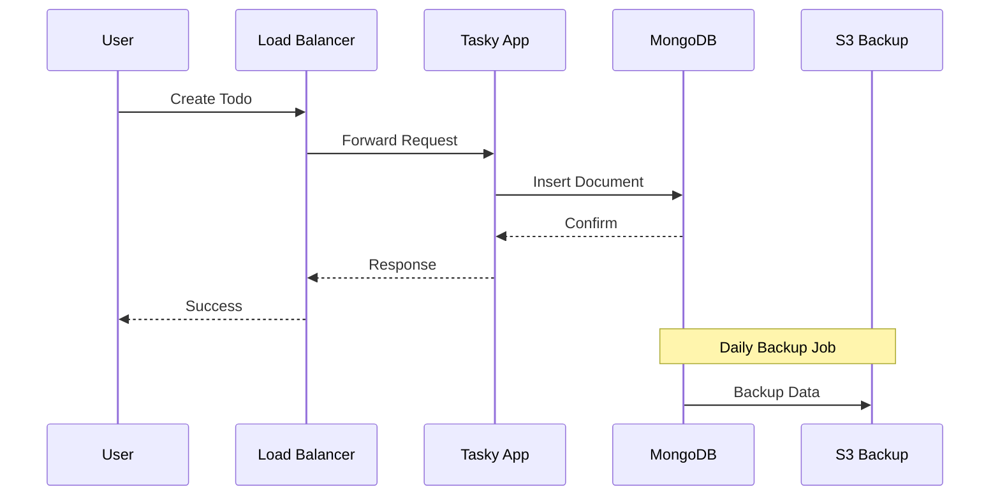

### Data at Rest

| Location | Data Type | Encryption | Risk |
|----------|-----------|------------|------|
| MongoDB | Application data | Volume encryption | Medium |
| S3 Bucket | Backups | **None** | **Critical** |
| K8s Secrets | Credentials | **Base64 only** | **Critical** |
| SSM Parameters | SSH Keys | KMS | Low |

### Data in Transit

| Path | Protocol | Encryption | Risk |
|------|----------|------------|------|
| User → ALB | HTTPS | TLS 1.2+ | Low |
| ALB → App | HTTP | **None** | Medium |
| App → MongoDB | TCP | **None** | High |
| MongoDB → S3 | HTTPS | TLS | Low |

## Credential Flow

### Application Credentials

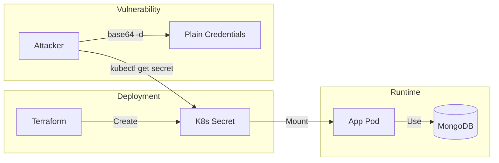

### SSH Key Flow

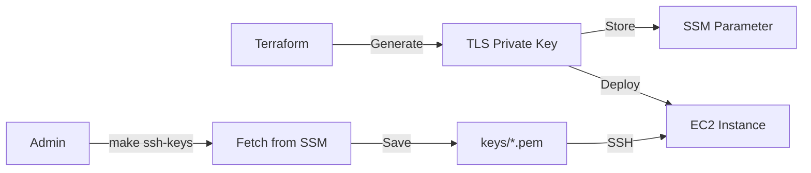

## Backup Data Flow

### Backup Process

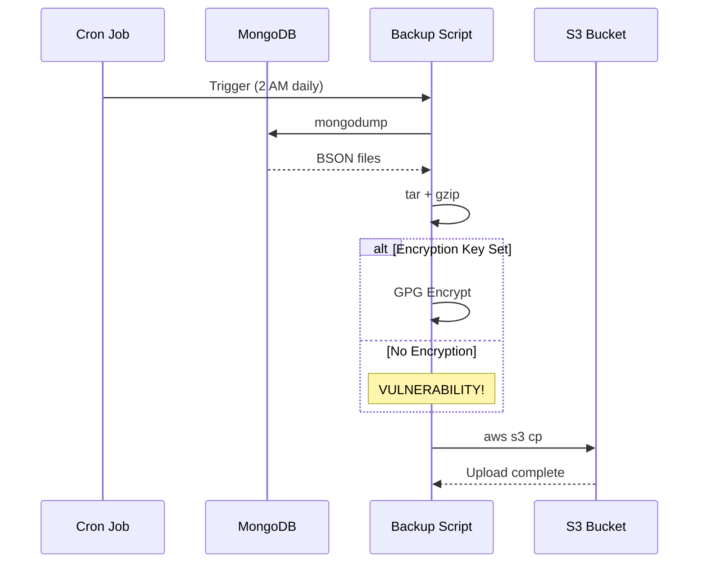

### Backup Vulnerability

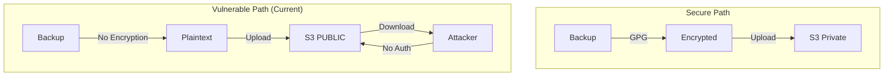

## Monitoring Data Flow

### Log Collection

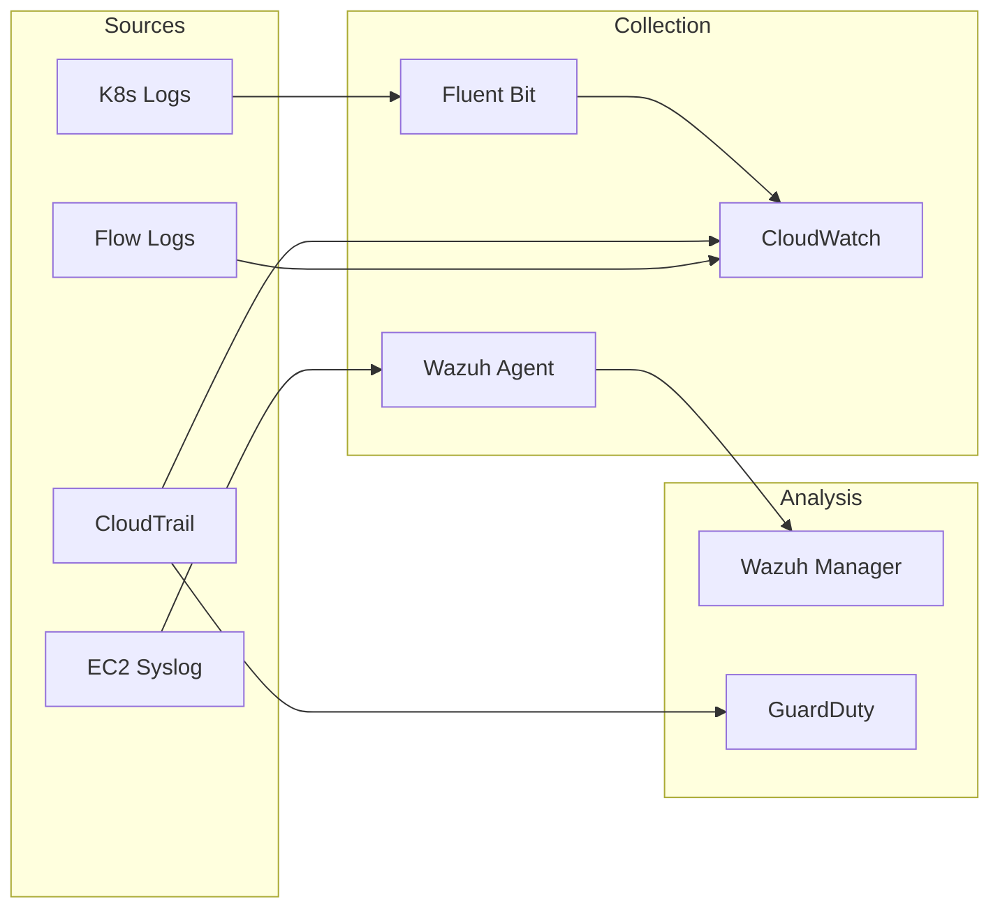

### Alert Flow

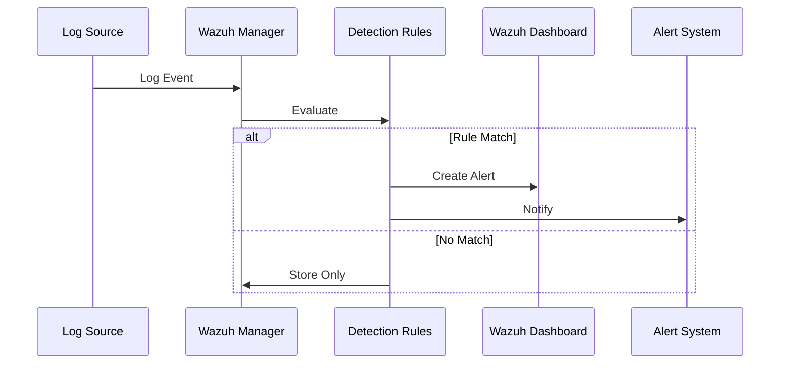

## Attack Data Flow

### S3 Exfiltration

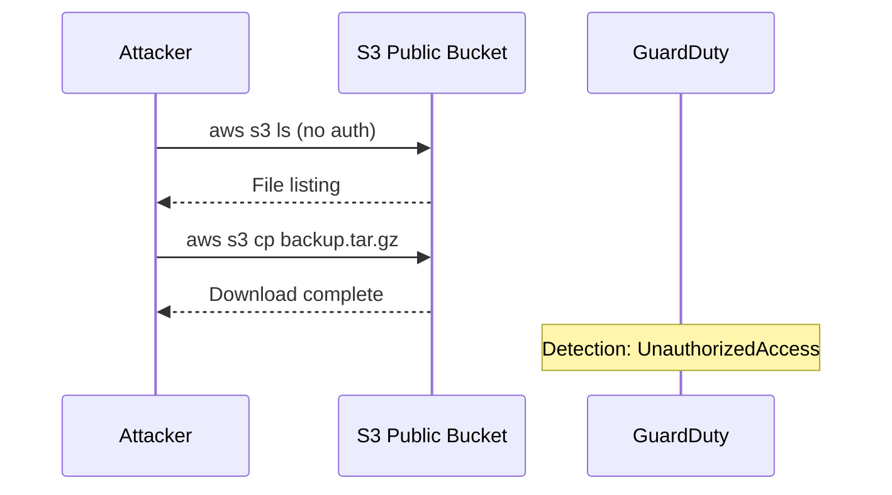

### Credential Theft via K8s

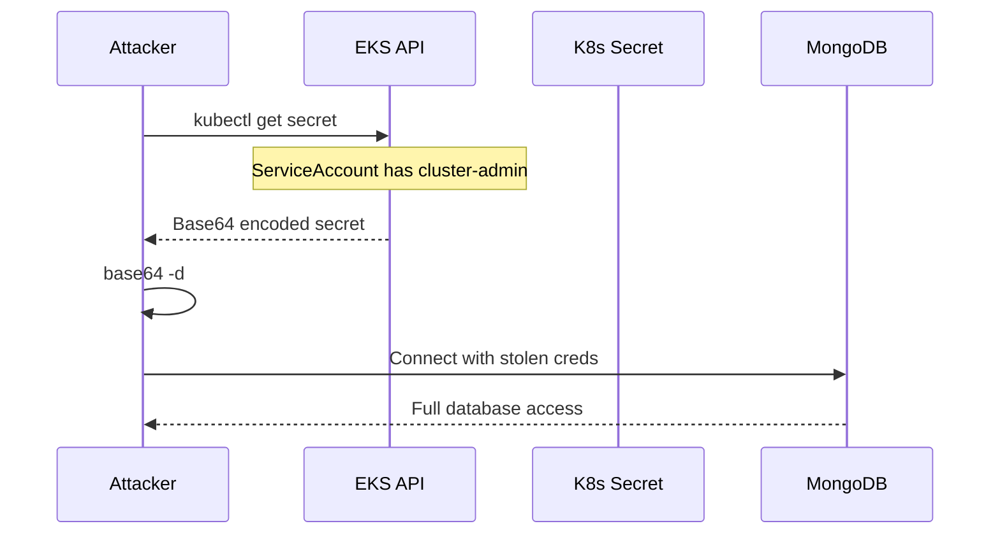

### IMDS Exploitation

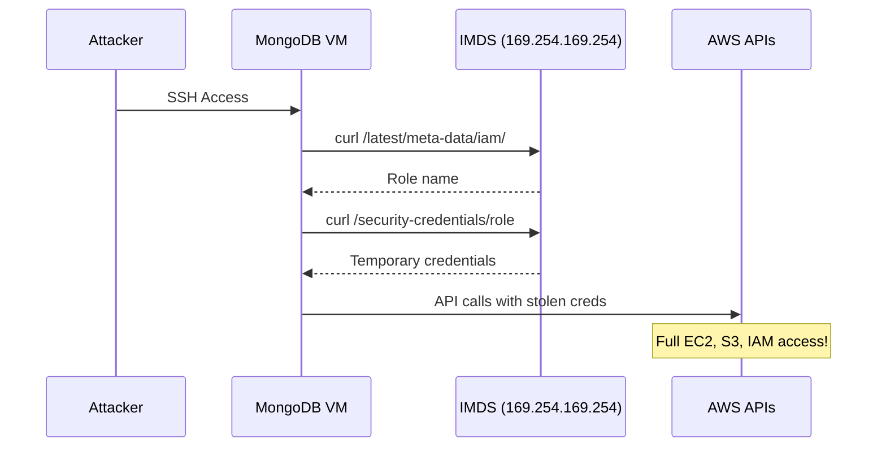

## Data Classification

### Sensitivity Levels

| Data | Classification | Current Protection | Required |
|------|---------------|-------------------|----------|
| User todos | Internal | Encryption at rest | Adequate |
| MongoDB creds | Secret | **Base64** | KMS/Vault |
| SSH keys | Secret | SSM + KMS | Adequate |
| Backups | Confidential | **None** | Encryption |
| AWS creds (IMDS) | Secret | **Exposed** | IMDSv2 |

### Data Residency

All data remains in `us-east-1`:

- MongoDB EBS volumes
- S3 bucket
- EKS persistent volumes
- CloudWatch logs
- SSM parameters

## Compliance Considerations

!!! warning "Not Compliant"
    This infrastructure violates multiple compliance frameworks intentionally:

### PCI DSS Violations

- Unencrypted cardholder data equivalent (credentials)
- Public access to data stores
- Missing access controls

### SOC 2 Violations

- Insufficient access controls
- Missing encryption
- Inadequate monitoring (detection only, no prevention)

### GDPR Violations

- No data protection by design
- Missing access logs for some paths
- No data minimization

## Remediation Data Flow

### Secure Architecture

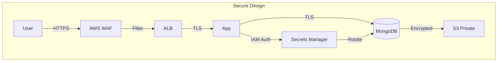

### Key Improvements

1. **Add WAF** - Filter malicious requests
2. **Enable TLS everywhere** - Encrypt in transit
3. **Use Secrets Manager** - Managed credential rotation
4. **Private S3** - Remove public access
5. **IMDSv2** - Require session tokens
6. **VPC Endpoints** - Keep traffic private
