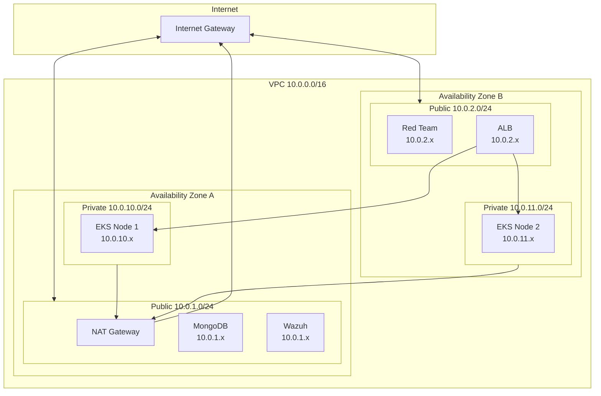
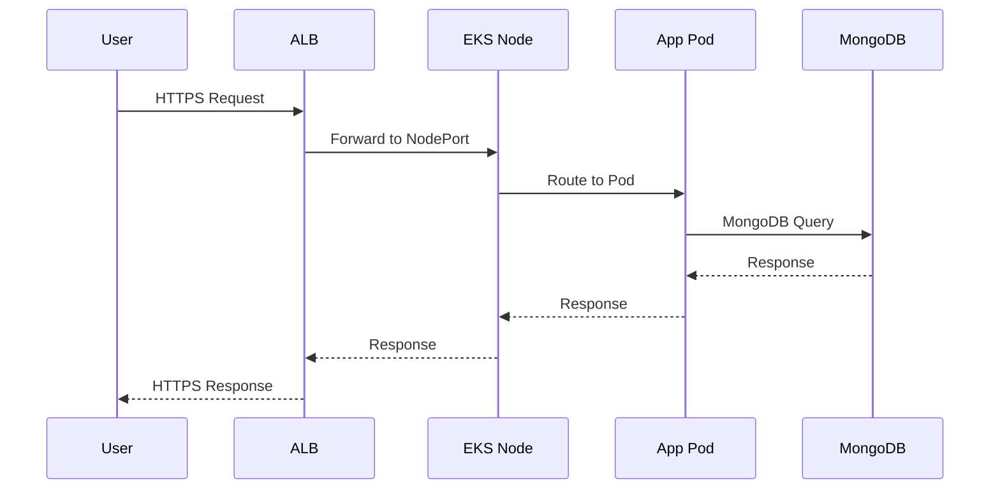
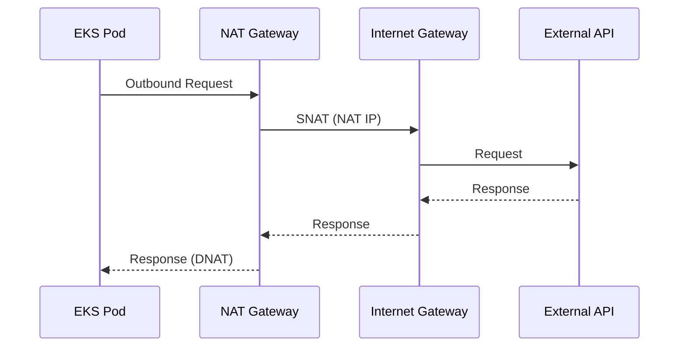
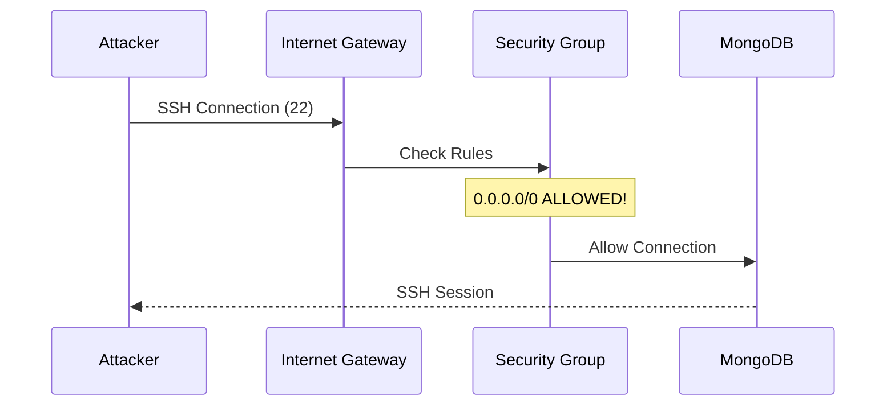

# Network Topology

Detailed documentation of the network architecture for the Wiz Technical Exercise.

## VPC Design

### CIDR Allocation

```
VPC: 10.0.0.0/16 (65,536 IPs)
│
├── Public Subnets (Internet-facing)
│   ├── 10.0.1.0/24 (256 IPs) - us-east-1a
│   └── 10.0.2.0/24 (256 IPs) - us-east-1b
│
└── Private Subnets (Internal)
    ├── 10.0.10.0/24 (256 IPs) - us-east-1a
    └── 10.0.11.0/24 (256 IPs) - us-east-1b
```

### Network Diagram



## Routing Tables

### Public Route Table

| Destination | Target | Purpose |
|-------------|--------|---------|
| 10.0.0.0/16 | local | VPC internal |
| 0.0.0.0/0 | igw-xxx | Internet access |

### Private Route Table

| Destination | Target | Purpose |
|-------------|--------|---------|
| 10.0.0.0/16 | local | VPC internal |
| 0.0.0.0/0 | nat-xxx | Outbound internet |

## Security Groups

### MongoDB Security Group

```hcl
# VULNERABILITY: SSH exposed to internet
resource "aws_security_group" "mongodb" {
  name = "mongodb-sg"

  # SSH from anywhere - INTENTIONALLY VULNERABLE
  ingress {
    from_port   = 22
    to_port     = 22
    protocol    = "tcp"
    cidr_blocks = ["0.0.0.0/0"]  # Should be restricted
  }

  # MongoDB from VPC
  ingress {
    from_port   = 27017
    to_port     = 27017
    protocol    = "tcp"
    cidr_blocks = ["10.0.0.0/16"]
  }

  # All outbound
  egress {
    from_port   = 0
    to_port     = 0
    protocol    = "-1"
    cidr_blocks = ["0.0.0.0/0"]
  }
}
```

**Vulnerability**: SSH (port 22) is open to `0.0.0.0/0`, allowing any IP to attempt connections.

### EKS Security Group

```hcl
resource "aws_security_group" "eks_nodes" {
  name = "eks-nodes-sg"

  # All traffic from ALB
  ingress {
    from_port       = 0
    to_port         = 65535
    protocol        = "tcp"
    security_groups = [aws_security_group.alb.id]
  }

  # Node-to-node communication
  ingress {
    from_port = 0
    to_port   = 65535
    protocol  = "tcp"
    self      = true
  }

  # Outbound via NAT
  egress {
    from_port   = 0
    to_port     = 0
    protocol    = "-1"
    cidr_blocks = ["0.0.0.0/0"]
  }
}
```

### Wazuh Security Group

```hcl
resource "aws_security_group" "wazuh" {
  name = "wazuh-sg"

  # Dashboard access
  ingress {
    from_port   = 443
    to_port     = 443
    protocol    = "tcp"
    cidr_blocks = ["0.0.0.0/0"]
  }

  # SSH for management
  ingress {
    from_port   = 22
    to_port     = 22
    protocol    = "tcp"
    cidr_blocks = ["0.0.0.0/0"]
  }

  # Agent communication from VPC
  ingress {
    from_port   = 1514
    to_port     = 1515
    protocol    = "tcp"
    cidr_blocks = ["10.0.0.0/16"]
  }

  egress {
    from_port   = 0
    to_port     = 0
    protocol    = "-1"
    cidr_blocks = ["0.0.0.0/0"]
  }
}
```

### ALB Security Group

```hcl
resource "aws_security_group" "alb" {
  name = "alb-sg"

  ingress {
    from_port   = 80
    to_port     = 80
    protocol    = "tcp"
    cidr_blocks = ["0.0.0.0/0"]
  }

  ingress {
    from_port   = 443
    to_port     = 443
    protocol    = "tcp"
    cidr_blocks = ["0.0.0.0/0"]
  }

  egress {
    from_port   = 0
    to_port     = 0
    protocol    = "-1"
    cidr_blocks = ["0.0.0.0/0"]
  }
}
```

## Network ACLs

Default NACLs are used (allow all). In a secure environment, you would restrict:

```hcl
# Example secure NACL
resource "aws_network_acl" "private" {
  vpc_id     = aws_vpc.main.id
  subnet_ids = aws_subnet.private[*].id

  # Allow inbound from VPC
  ingress {
    rule_no    = 100
    action     = "allow"
    protocol   = "-1"
    cidr_block = "10.0.0.0/16"
    from_port  = 0
    to_port    = 0
  }

  # Allow return traffic
  ingress {
    rule_no    = 200
    action     = "allow"
    protocol   = "tcp"
    cidr_block = "0.0.0.0/0"
    from_port  = 1024
    to_port    = 65535
  }

  # Allow outbound to VPC
  egress {
    rule_no    = 100
    action     = "allow"
    protocol   = "-1"
    cidr_block = "10.0.0.0/16"
    from_port  = 0
    to_port    = 0
  }

  # Allow outbound HTTPS
  egress {
    rule_no    = 200
    action     = "allow"
    protocol   = "tcp"
    cidr_block = "0.0.0.0/0"
    from_port  = 443
    to_port    = 443
  }
}
```

## Traffic Flow

### Inbound Web Traffic



### Outbound from Private Subnet



### Attack Path: SSH to MongoDB



## DNS Configuration

### Internal DNS

EKS uses CoreDNS for internal service discovery:

```
<service>.<namespace>.svc.cluster.local
```

Example:
```
tasky-service.tasky.svc.cluster.local
```

### External DNS

EC2 instances use VPC DNS:

- DNS Server: `10.0.0.2` (VPC base + 2)
- DNS Resolution: Enabled
- DNS Hostnames: Enabled

## VPC Endpoints (Not Configured)

!!! warning "Missing VPC Endpoints"
    This infrastructure does NOT use VPC endpoints, forcing traffic through NAT Gateway. In production, add endpoints for:

    - S3 (Gateway endpoint)
    - ECR (Interface endpoint)
    - SSM (Interface endpoint)
    - STS (Interface endpoint)

Example S3 endpoint:

```hcl
resource "aws_vpc_endpoint" "s3" {
  vpc_id       = aws_vpc.main.id
  service_name = "com.amazonaws.${var.region}.s3"

  route_table_ids = [
    aws_route_table.private.id
  ]
}
```

## VPC Flow Logs

Flow logs are enabled for security monitoring:

```hcl
resource "aws_flow_log" "main" {
  vpc_id          = aws_vpc.main.id
  traffic_type    = "ALL"
  log_destination = aws_cloudwatch_log_group.flow_logs.arn
  iam_role_arn    = aws_iam_role.flow_logs.arn
}
```

Log format:
```
${version} ${account-id} ${interface-id} ${srcaddr} ${dstaddr} ${srcport} ${dstport} ${protocol} ${packets} ${bytes} ${start} ${end} ${action} ${log-status}
```

## Network Security Recommendations

### What Should Be Fixed

1. **Restrict SSH access**
   ```hcl
   cidr_blocks = ["10.0.0.0/8"]  # Internal only
   # Or use SSM Session Manager
   ```

2. **Add VPC endpoints**
   - Reduces NAT costs
   - Keeps traffic private

3. **Enable NACL rules**
   - Defense in depth
   - Subnet-level filtering

4. **Implement AWS Network Firewall**
   - Deep packet inspection
   - Threat intelligence

5. **Use PrivateLink for MongoDB**
   - Remove from public subnet
   - Access via private endpoint
