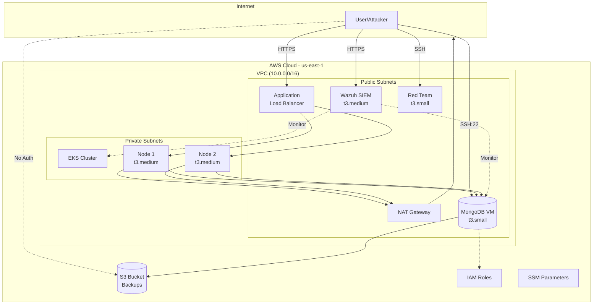
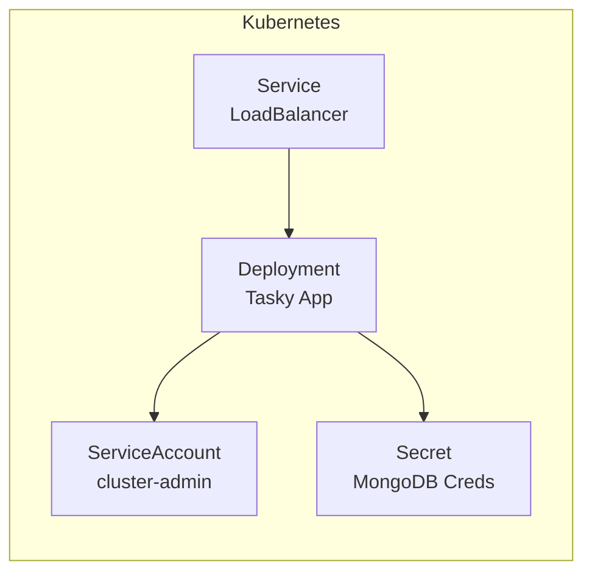
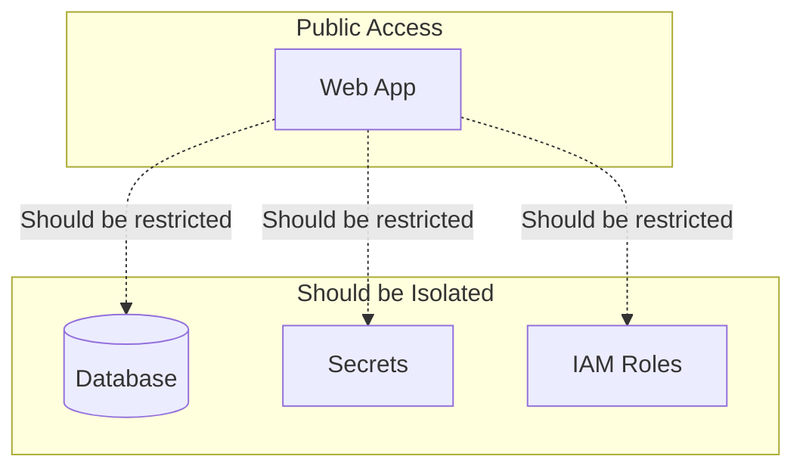
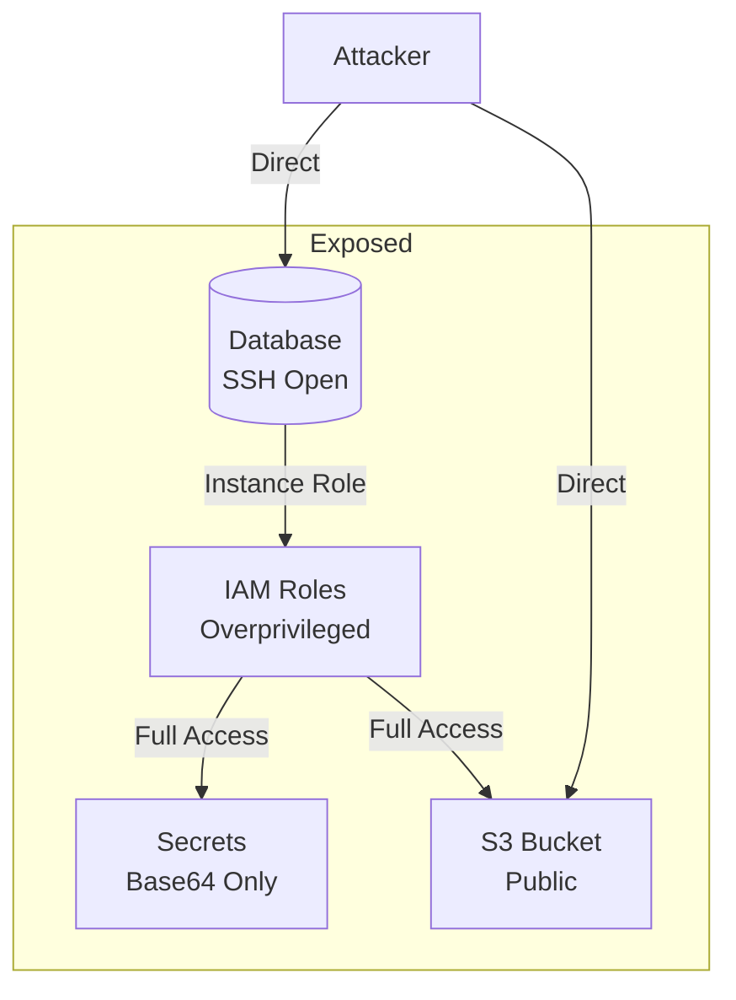
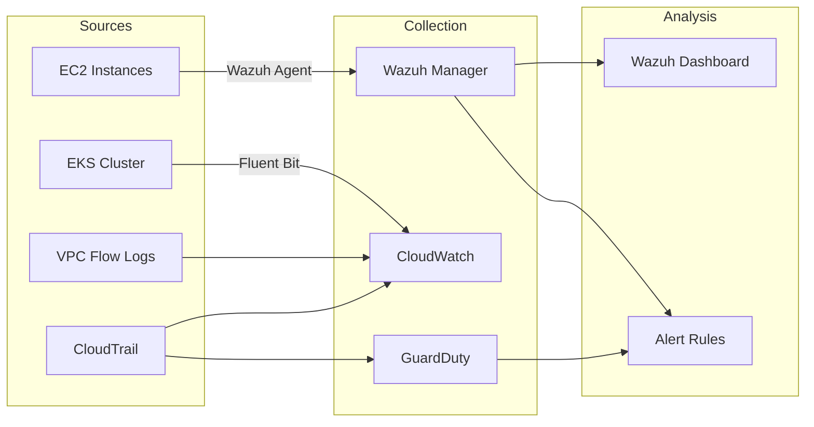
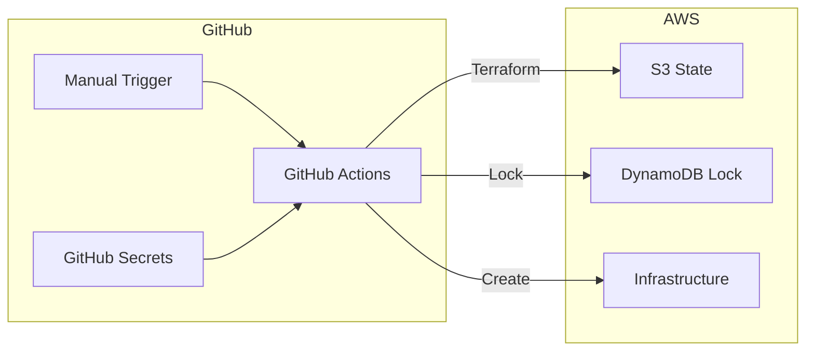
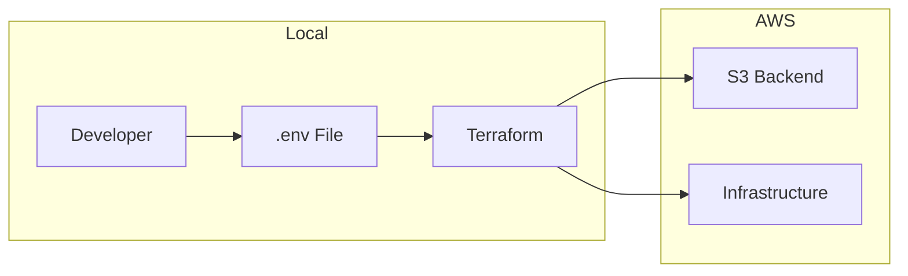

# Architecture Overview

The Wiz Technical Exercise deploys a deliberately vulnerable two-tier web application infrastructure on AWS, designed to demonstrate common cloud security misconfigurations.

## High-Level Architecture



## Component Summary

| Component | Purpose | Instance Type | Vulnerability |
|-----------|---------|---------------|---------------|
| EKS Cluster | Kubernetes hosting | t3.medium (2 nodes) | Overprivileged ServiceAccount |
| MongoDB VM | Database server | t3.small | Exposed SSH, overprivileged IAM |
| Wazuh SIEM | Security monitoring | t3.medium | Detection platform |
| Red Team | Attack simulation | t3.small | Pre-installed tools |
| S3 Bucket | Backup storage | - | Public access |
| ALB | Load balancing | - | Ingress point |

## Design Principles

### Intentional Vulnerabilities

This infrastructure is designed with specific security flaws:

1. **Defense in Depth Violations** - Single points of failure
2. **Least Privilege Violations** - Overprivileged IAM roles
3. **Public Exposure** - Services accessible from internet
4. **Missing Encryption** - Plaintext secrets
5. **Outdated Software** - Vulnerable versions

### Educational Focus

Each vulnerability maps to:

- Real-world attack scenarios
- AWS security best practices
- Detection mechanisms
- Remediation steps

## Infrastructure Layers

### Layer 1: Networking

```
VPC (10.0.0.0/16)
├── Public Subnet A (10.0.1.0/24) - us-east-1a
│   ├── Internet Gateway
│   ├── NAT Gateway
│   ├── MongoDB VM
│   └── Wazuh VM
├── Public Subnet B (10.0.2.0/24) - us-east-1b
│   ├── Red Team VM
│   └── ALB (multi-AZ)
├── Private Subnet A (10.0.10.0/24) - us-east-1a
│   └── EKS Node 1
└── Private Subnet B (10.0.11.0/24) - us-east-1b
    └── EKS Node 2
```

### Layer 2: Compute

| Resource | Subnet | Access |
|----------|--------|--------|
| EKS Nodes | Private | Via ALB/NAT |
| MongoDB | Public | Direct SSH |
| Wazuh | Public | HTTPS Dashboard |
| Red Team | Public | SSH |

### Layer 3: Application



### Layer 4: Data

| Store | Type | Encryption | Access |
|-------|------|------------|--------|
| MongoDB | Document DB | At-rest only | Authenticated |
| S3 Bucket | Object storage | None | **Public** |
| K8s Secrets | Base64 | None | RBAC (broken) |
| SSM Parameters | Key-value | KMS | IAM |

## Security Boundaries

### Intended Boundaries (Broken)



### Actual State (Vulnerable)



## Attack Surface

### External Attack Surface

| Entry Point | Protocol | Risk | Vulnerability |
|-------------|----------|------|---------------|
| ALB | HTTPS | Medium | Application bugs |
| MongoDB SSH | TCP/22 | **Critical** | Direct access |
| Wazuh Dashboard | HTTPS | Low | Admin interface |
| S3 Bucket | HTTPS | **Critical** | No authentication |

### Internal Attack Surface

| From | To | Risk | Path |
|------|---|------|------|
| EKS Pod | All Secrets | **Critical** | cluster-admin SA |
| MongoDB VM | AWS APIs | **Critical** | Overprivileged IAM |
| Any EC2 | IMDS | High | IMDSv1 enabled |

## Monitoring Architecture



## Deployment Architecture

### GitHub Actions Pipeline



### Local Deployment



## Cost Architecture

### Resource Costs (Estimated Monthly)

| Resource | Quantity | Unit Cost | Monthly |
|----------|----------|-----------|---------|
| EKS Control Plane | 1 | $0.10/hr | $73 |
| t3.medium (nodes) | 2 | $0.0416/hr | $60 |
| t3.small (VMs) | 2 | $0.0208/hr | $30 |
| t3.medium (Wazuh) | 1 | $0.0416/hr | $30 |
| NAT Gateway | 1 | $0.045/hr | $33 |
| ALB | 1 | $0.0225/hr | $16 |
| S3 | ~1GB | $0.023/GB | $1 |
| Data Transfer | Variable | $0.09/GB | ~$10 |

**Estimated Total**: $250-300/month (24/7 operation)

### Cost Optimization

```bash
# Destroy when not in use
make destroy

# Use spot instances (modify tfvars)
eks_node_capacity_type = "SPOT"
```

## Related Documentation

- [Network Topology](network.md) - Detailed network architecture
- [Data Flow](data-flow.md) - How data moves through the system
- [Security Model](security-model.md) - Security architecture (and its flaws)
