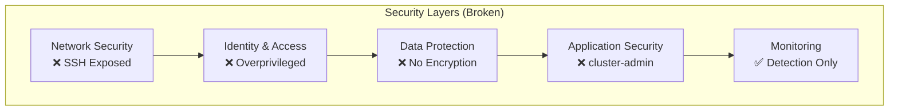
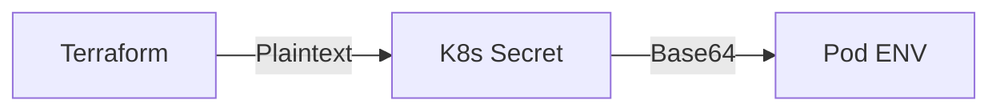
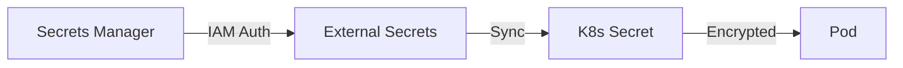
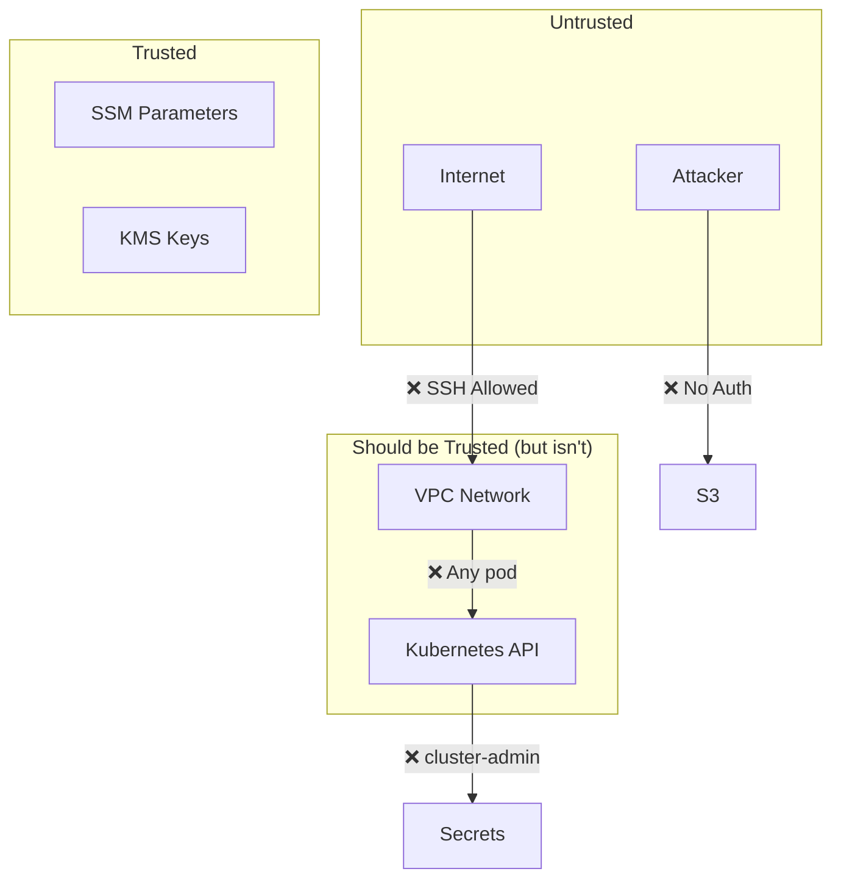

# Security Model

Analysis of the (intentionally flawed) security architecture in the Wiz Technical Exercise.

## Security Architecture Overview

This infrastructure demonstrates what happens when security best practices are ignored. Each component has deliberate vulnerabilities.



## Authentication & Authorization

### IAM Configuration

#### MongoDB VM Role (Overprivileged)

```json
{
  "Version": "2012-10-17",
  "Statement": [
    {
      "Effect": "Allow",
      "Action": [
        "s3:*",           // VULNERABLE: Full S3 access
        "ec2:Describe*",  // VULNERABLE: EC2 enumeration
        "iam:Get*",       // VULNERABLE: IAM enumeration
        "iam:List*",
        "secretsmanager:GetSecretValue"  // VULNERABLE: Secret access
      ],
      "Resource": "*"     // VULNERABLE: All resources
    }
  ]
}
```

**What it should be:**

```json
{
  "Version": "2012-10-17",
  "Statement": [
    {
      "Effect": "Allow",
      "Action": [
        "s3:PutObject",
        "s3:GetObject"
      ],
      "Resource": "arn:aws:s3:::backup-bucket/backups/*"
    }
  ]
}
```

#### EKS Node Role

The EKS node role is appropriately scoped, but the **ServiceAccount** is not:

```yaml
# VULNERABLE: cluster-admin binding
apiVersion: rbac.authorization.k8s.io/v1
kind: ClusterRoleBinding
metadata:
  name: tasky-cluster-admin
subjects:
- kind: ServiceAccount
  name: tasky-sa
  namespace: tasky
roleRef:
  kind: ClusterRole
  name: cluster-admin  # FULL CLUSTER ACCESS
  apiGroup: rbac.authorization.k8s.io
```

**What it should be:**

```yaml
apiVersion: rbac.authorization.k8s.io/v1
kind: Role
metadata:
  name: tasky-role
  namespace: tasky
rules:
- apiGroups: [""]
  resources: ["secrets"]
  resourceNames: ["mongodb-credentials"]
  verbs: ["get"]
```

### SSH Authentication

SSH is configured for public key authentication only:

```bash
# Good: Password auth disabled
PasswordAuthentication no
ChallengeResponseAuthentication no
PubkeyAuthentication yes
PermitRootLogin no
```

**But**: SSH port (22) is exposed to `0.0.0.0/0`.

## Network Security

### Perimeter Security

| Control | Status | Risk |
|---------|--------|------|
| WAF | ❌ Not deployed | High |
| DDoS Protection | ❌ Basic only | Medium |
| Network Firewall | ❌ Not deployed | High |
| Security Groups | ⚠️ Misconfigured | Critical |

### Segmentation

| Zone | Isolation | Issue |
|------|-----------|-------|
| Public → Private | ✅ Enforced | - |
| Internet → MongoDB | ❌ Direct SSH | Critical |
| EKS → MongoDB | ⚠️ Network only | No auth required from VPC |

### Missing Controls

1. **No VPC endpoints** - Traffic traverses NAT
2. **No NACL rules** - Default allow-all
3. **No flow log analysis** - Collected but not analyzed
4. **No network firewall** - No deep inspection

## Data Protection

### Encryption Status

| Data Type | At Rest | In Transit | Key Management |
|-----------|---------|------------|----------------|
| MongoDB | ✅ EBS | ❌ Plaintext | AWS managed |
| S3 Backups | ❌ None | ✅ TLS | ❌ None |
| K8s Secrets | ❌ Base64 | ✅ TLS | ❌ None |
| SSH Keys | ✅ SSM | ✅ TLS | ✅ KMS |
| CloudWatch | ✅ Default | ✅ TLS | AWS managed |

### Secret Management

Current (Insecure):


Recommended:


## Instance Metadata Security

### IMDS Configuration (Vulnerable)

```hcl
# Current: IMDSv1 enabled (default)
metadata_options {
  http_endpoint = "enabled"
  http_tokens   = "optional"  # VULNERABLE
}
```

### Attack Vector

```bash
# From compromised instance
curl http://169.254.169.254/latest/meta-data/iam/security-credentials/
# Returns: mongodb-role

curl http://169.254.169.254/latest/meta-data/iam/security-credentials/mongodb-role
# Returns: Temporary AWS credentials!
```

### Secure Configuration

```hcl
metadata_options {
  http_endpoint               = "enabled"
  http_tokens                 = "required"  # IMDSv2 only
  http_put_response_hop_limit = 1
}
```

## Vulnerability Summary

### Critical (Exploitable)

| ID | Vulnerability | Component | CVSS | Exploitability |
|----|---------------|-----------|------|----------------|
| V1 | Public S3 Bucket | S3 | 9.8 | Trivial |
| V2 | Overprivileged IAM | MongoDB VM | 9.1 | Easy |
| V3 | cluster-admin SA | EKS | 9.0 | Easy |
| V4 | Exposed SSH | MongoDB VM | 8.1 | Medium |

### High

| ID | Vulnerability | Component | CVSS | Exploitability |
|----|---------------|-----------|------|----------------|
| V5 | Plaintext Secrets | K8s | 7.5 | Easy |
| V6 | IMDSv1 Enabled | EC2 | 7.2 | Medium |
| V7 | No WAF | ALB | 7.0 | Medium |

### Medium

| ID | Vulnerability | Component | CVSS | Exploitability |
|----|---------------|-----------|------|----------------|
| V8 | Outdated MongoDB | MongoDB VM | 6.5 | Medium |
| V9 | No TLS Internal | App→DB | 5.9 | Medium |
| V10 | Missing NACLs | VPC | 5.0 | Low |

## Detection Capabilities

### What We CAN Detect

| Attack | Detection Method | Alert |
|--------|-----------------|-------|
| S3 public access | GuardDuty, Security Hub | Yes |
| Unusual API calls | CloudTrail + GuardDuty | Yes |
| SSH brute force | Wazuh, GuardDuty | Yes |
| K8s API abuse | GuardDuty EKS | Yes |
| IMDS access | VPC Flow Logs | Partial |

### What We CANNOT Prevent

| Attack | Why | Fix |
|--------|-----|-----|
| S3 data theft | Public access enabled | Enable blocking |
| IAM privilege abuse | Permissions granted | Least privilege |
| Cluster takeover | SA has admin | Restrict RBAC |
| SSH access | Port open | Restrict SG |

## Trust Boundaries



## Compliance Mapping

| Control | CIS Benchmark | Status | Finding |
|---------|--------------|--------|---------|
| 2.1.1 | S3 public access | ❌ Fail | Bucket is public |
| 2.1.2 | S3 encryption | ❌ Fail | No encryption |
| 4.1 | SSH access | ❌ Fail | Open to 0.0.0.0/0 |
| 4.2 | Security groups | ❌ Fail | Overly permissive |
| 5.1 | IAM policies | ❌ Fail | Overprivileged |
| 5.4 | MFA | ⚠️ N/A | Not applicable |

## Remediation Priority

### Immediate (P0)

1. Remove S3 public access
2. Restrict IAM permissions
3. Fix Kubernetes RBAC

### Short-term (P1)

1. Restrict SSH security group
2. Enable IMDSv2
3. Encrypt secrets properly

### Medium-term (P2)

1. Deploy WAF
2. Add VPC endpoints
3. Implement NACL rules

### Long-term (P3)

1. Network firewall
2. Zero-trust architecture
3. Service mesh
