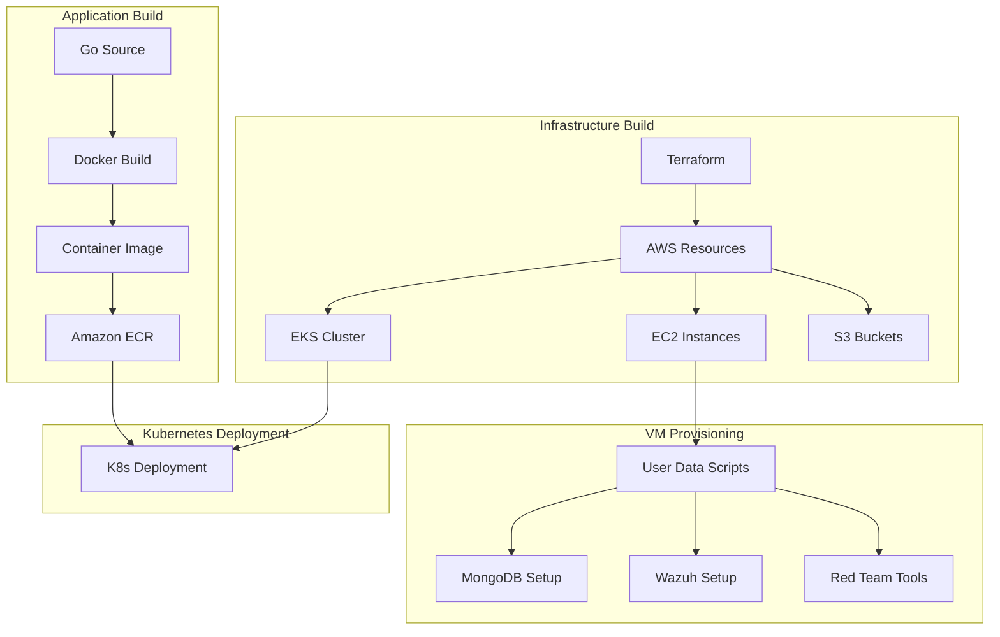
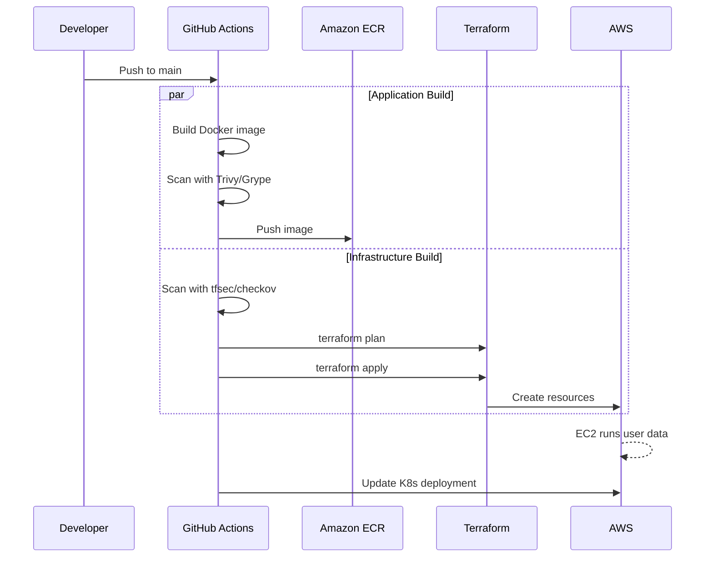

# Build Overview

This section documents how all components of the Wiz Technical Exercise are built, from container images to VM provisioning.

## Build Architecture



## Components

| Component | Build Method | Location | Documentation |
|-----------|--------------|----------|---------------|
| Tasky App | Multi-stage Dockerfile | `app/` | [Container Build](container.md) |
| MongoDB VM | EC2 + User Data | `terraform/modules/mongodb-vm/` | [VM Provisioning](vm-provisioning.md) |
| Wazuh Manager | EC2 + Docker Compose | `terraform/modules/wazuh/` | [VM Provisioning](vm-provisioning.md) |
| Red Team Instance | EC2 + User Data | `terraform/modules/redteam/` | [VM Provisioning](vm-provisioning.md) |
| EKS Cluster | Terraform EKS Module | `terraform/modules/eks/` | [Infrastructure](../infrastructure/eks.md) |

## Build Pipelines

### CI/CD Workflows

Two GitHub Actions workflows handle builds:

1. **Infrastructure Pipeline** (`deploy-infra.yml`)
   - Terraform plan/apply
   - Security scanning (tfsec, checkov)
   - State management

2. **Application Pipeline** (`build-deploy-app.yml`)
   - Docker build
   - Vulnerability scanning (Trivy, Grype)
   - ECR push
   - Kubernetes deployment

See [GitHub Actions Reference](../reference/github-actions.md) for details.

### Local Build Options

```bash
# Build container locally
make test-container

# Deploy infrastructure locally
make deploy-local

# Full deployment via GitHub Actions
make build
```

## Build Flow



## Prerequisites

### Required Tools

| Tool | Version | Purpose |
|------|---------|---------|
| Docker | 20.10+ | Container builds |
| Go | 1.19+ | Local app development |
| Terraform | 1.6+ | Infrastructure provisioning |
| AWS CLI | 2.x | AWS interactions |
| kubectl | 1.28+ | Kubernetes management |

### Verify Prerequisites

```bash
make check-prereqs
```

## Quick Reference

| Task | Command |
|------|---------|
| Build container locally | `docker build -t tasky app/` |
| Run container locally | `docker run -p 8080:8080 tasky` |
| Validate Terraform | `make test-terraform` |
| Security scan | `make test-security` |
| Full local deploy | `make deploy-local` |
| Deploy via CI/CD | `make build` |

## Related Documentation

- [Container Build](container.md) - Dockerfile and image details
- [VM Provisioning](vm-provisioning.md) - EC2 user data scripts
- [Application Build](application.md) - Go application compilation
- [GitHub Actions](../reference/github-actions.md) - CI/CD pipelines
