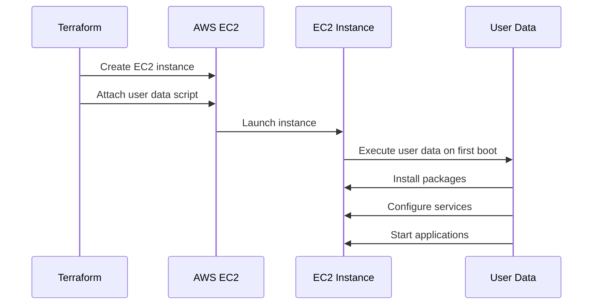
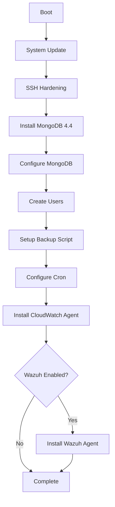
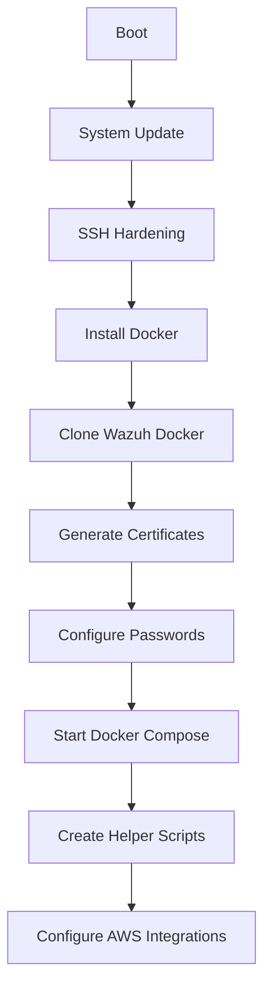
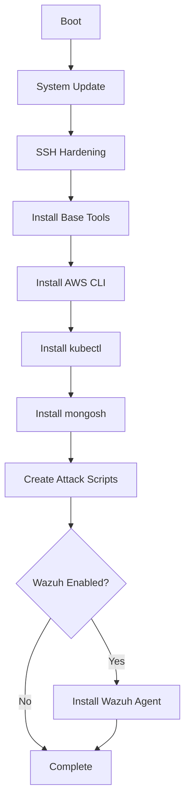

# VM Provisioning

Documentation for EC2 instance provisioning using Terraform and user data scripts.

## Overview

Three EC2 instances are provisioned with user data scripts:

| Instance | AMI | User Data Template | Purpose |
|----------|-----|-------------------|---------|
| MongoDB | Ubuntu 20.04 | `mongodb-userdata.sh.tpl` | Database server |
| Wazuh | Ubuntu 22.04 | `wazuh-userdata.sh.tpl` | SIEM/Security monitoring |
| Red Team | Ubuntu 22.04 | `redteam-userdata.sh.tpl` | Attack simulation |

## How VM Provisioning Works



## User Data Execution

### How It Works

1. **cloud-init** runs on first boot
2. User data script executed as `root`
3. Output logged to `/var/log/cloud-init-output.log`
4. Script runs **once** (unless instance is rebuilt)

### Checking User Data Status

```bash
# SSH to instance
ssh -i keys/mongodb.pem ubuntu@<ip>

# Check cloud-init status
cloud-init status

# View user data log
sudo cat /var/log/cloud-init-output.log

# View custom log (if script creates one)
sudo cat /var/log/user-data.log
```

---

## MongoDB VM Provisioning

### Template Location

```
terraform/modules/mongodb-vm/templates/mongodb-userdata.sh.tpl
```

### Provisioning Flow



### Script Breakdown

#### 1. System Setup

```bash
# Log everything to file
exec > >(tee /var/log/user-data.log) 2>&1

# Update system
apt-get update
apt-get upgrade -y
```

#### 2. SSH Hardening

```bash
# Disable password authentication
sed -i 's/^#*PasswordAuthentication.*/PasswordAuthentication no/' /etc/ssh/sshd_config
sed -i 's/^#*PermitRootLogin.*/PermitRootLogin no/' /etc/ssh/sshd_config
systemctl restart sshd
```

#### 3. MongoDB Installation

```bash
# Add MongoDB 4.4 repository (INTENTIONALLY OUTDATED)
curl -fsSL https://pgp.mongodb.com/server-4.4.asc | gpg --dearmor -o /usr/share/keyrings/mongodb-server-4.4.gpg
echo "deb [...] https://repo.mongodb.org/apt/ubuntu focal/mongodb-org/4.4 multiverse" | tee /etc/apt/sources.list.d/mongodb-org-4.4.list

# Install specific version
apt-get install -y mongodb-org=4.4.29

# Pin version to prevent auto-updates
echo "mongodb-org hold" | dpkg --set-selections
```

#### 4. MongoDB Configuration

```yaml
# /etc/mongod.conf
storage:
  dbPath: /var/lib/mongodb
net:
  port: 27017
  bindIp: 0.0.0.0  # Listen on all interfaces
security:
  authorization: enabled
```

#### 5. User Creation

```bash
# Create admin user
mongosh admin --eval "
db.createUser({
  user: '${mongodb_admin_user}',
  pwd: '${mongodb_admin_pass}',
  roles: [
    { role: 'userAdminAnyDatabase', db: 'admin' },
    { role: 'readWriteAnyDatabase', db: 'admin' }
  ]
})"

# Create application user
mongosh admin -u admin -p '...' --eval "
use ${mongodb_database}
db.createUser({
  user: '${mongodb_app_user}',
  pwd: '${mongodb_app_pass}',
  roles: [{ role: 'readWrite', db: '${mongodb_database}' }]
})"
```

#### 6. Backup Script

```bash
# /usr/local/bin/mongodb-backup.sh
mongodump --uri="mongodb://..." --out="$BACKUP_DIR"
tar -czf "$BACKUP_FILE" "$BACKUP_DIR"

# Optional GPG encryption
gpg --batch --passphrase "$ENCRYPTION_KEY" --symmetric "$BACKUP_FILE"

# Upload to S3
aws s3 cp "$BACKUP_FILE" "s3://$BUCKET/backups/"
```

#### 7. Cron Job

```bash
# Daily backup at 2 AM
echo "0 2 * * * root /usr/local/bin/mongodb-backup.sh" > /etc/cron.d/mongodb-backup
```

#### 8. Wazuh Agent (Conditional)

```bash
%{ if enable_wazuh_agent && wazuh_manager_ip != "" ~}
# Install Wazuh agent
WAZUH_MANAGER="${wazuh_manager_ip}" apt-get install -y wazuh-agent
systemctl enable wazuh-agent && systemctl start wazuh-agent
%{ endif ~}
```

### Template Variables

| Variable | Source | Description |
|----------|--------|-------------|
| `mongodb_admin_user` | Terraform variable | Admin username |
| `mongodb_admin_pass` | Terraform variable (sensitive) | Admin password |
| `mongodb_app_user` | Terraform variable | App username |
| `mongodb_app_pass` | Terraform variable (sensitive) | App password |
| `mongodb_database` | Terraform variable | Database name |
| `backup_bucket` | S3 module output | Backup bucket name |
| `backup_encryption_key` | Terraform variable (sensitive) | GPG passphrase |
| `environment` | Terraform variable | Environment name |
| `enable_wazuh_agent` | Terraform variable | Enable Wazuh |
| `wazuh_manager_ip` | Wazuh module output | Manager IP |

---

## Wazuh VM Provisioning

### Template Location

```
terraform/modules/wazuh/templates/wazuh-userdata.sh.tpl
```

### Provisioning Flow



### Key Components

#### Docker Installation

```bash
# Add Docker repository
curl -fsSL https://download.docker.com/linux/ubuntu/gpg | gpg --dearmor -o /usr/share/keyrings/docker-archive-keyring.gpg

# Install Docker CE
apt-get install -y docker-ce docker-ce-cli containerd.io docker-compose-plugin
```

#### Wazuh Deployment

```bash
# Clone official Wazuh Docker repository
git clone https://github.com/wazuh/wazuh-docker.git -b v4.7.0

cd wazuh-docker/single-node

# Generate TLS certificates
docker compose -f generate-indexer-certs.yml run --rm generator

# Set passwords in .env
sed -i "s/INDEXER_PASSWORD=.*/INDEXER_PASSWORD=${wazuh_admin_pass}/" .env

# Start stack
docker compose up -d
```

#### AWS Service Integrations

```bash
# CloudTrail integration
<wodle name="aws-s3">
  <bucket type="cloudtrail">
    <name>${cloudtrail_bucket}</name>
    <regions>${aws_region}</regions>
  </bucket>
</wodle>

# VPC Flow Logs integration
<wodle name="aws-cloudwatchlogs">
  <log_group>${vpc_flow_logs_group}</log_group>
</wodle>

# GuardDuty integration
<wodle name="aws-s3">
  <service type="guardduty">
    <regions>${aws_region}</regions>
  </service>
</wodle>
```

---

## Red Team VM Provisioning

### Template Location

```
terraform/modules/redteam/templates/redteam-userdata.sh.tpl
```

### Provisioning Flow



### Tools Installed

| Tool | Purpose |
|------|---------|
| nmap | Network scanning |
| netcat | Network connectivity |
| AWS CLI v2 | Cloud enumeration |
| kubectl | Kubernetes access |
| mongosh | MongoDB client |
| jq | JSON processing |

### Attack Scripts Created

| Script | Purpose |
|--------|---------|
| `01-recon.sh` | S3 enumeration, port scanning |
| `02-s3-exfil.sh` | Download from public bucket |
| `03-k8s-exploit.sh` | Extract K8s secrets |
| `04-mongodb-access.sh` | Database access |
| `05-privesc.sh` | IMDS credential theft |

---

## Terraform Integration

### Passing Variables to User Data

```hcl
resource "aws_instance" "mongodb" {
  # ...

  user_data = templatefile("${path.module}/templates/mongodb-userdata.sh.tpl", {
    mongodb_admin_user    = var.mongodb_admin_user
    mongodb_admin_pass    = var.mongodb_admin_pass
    environment           = var.environment
    enable_wazuh_agent    = var.enable_wazuh_agent
    wazuh_manager_ip      = var.wazuh_manager_ip
  })
}
```

### AMI Selection

```hcl
data "aws_ami" "ubuntu" {
  most_recent = true
  owners      = ["099720109477"]  # Canonical

  filter {
    name   = "name"
    values = ["ubuntu/images/hvm-ssd/ubuntu-focal-20.04-amd64-server-*"]
  }
}
```

---

## Debugging VM Provisioning

### Check Cloud-Init Status

```bash
ssh -i keys/mongodb.pem ubuntu@<ip>
cloud-init status --wait
```

### View User Data Logs

```bash
# Cloud-init output
sudo cat /var/log/cloud-init-output.log

# Custom log (if created)
sudo cat /var/log/user-data.log

# System journal
sudo journalctl -u cloud-init
```

### Re-run User Data (Testing)

```bash
# Remove cloud-init state
sudo rm -rf /var/lib/cloud/instances/*

# Re-run
sudo cloud-init init
sudo cloud-init modules --mode=config
sudo cloud-init modules --mode=final
```

### Common Issues

| Issue | Symptom | Solution |
|-------|---------|----------|
| Script syntax error | Provisioning stops early | Check logs, validate script locally |
| Package not found | apt-get fails | Check repository configuration |
| Service won't start | Application unavailable | Check systemd logs |
| Timeout | Instance unhealthy | Increase script timeout or optimize |

---

## Related Documentation

- [MongoDB Infrastructure](../infrastructure/mongodb.md)
- [Wazuh Infrastructure](../infrastructure/wazuh.md)
- [Red Team Infrastructure](../infrastructure/redteam.md)
- [Terraform Reference](../reference/terraform.md)
