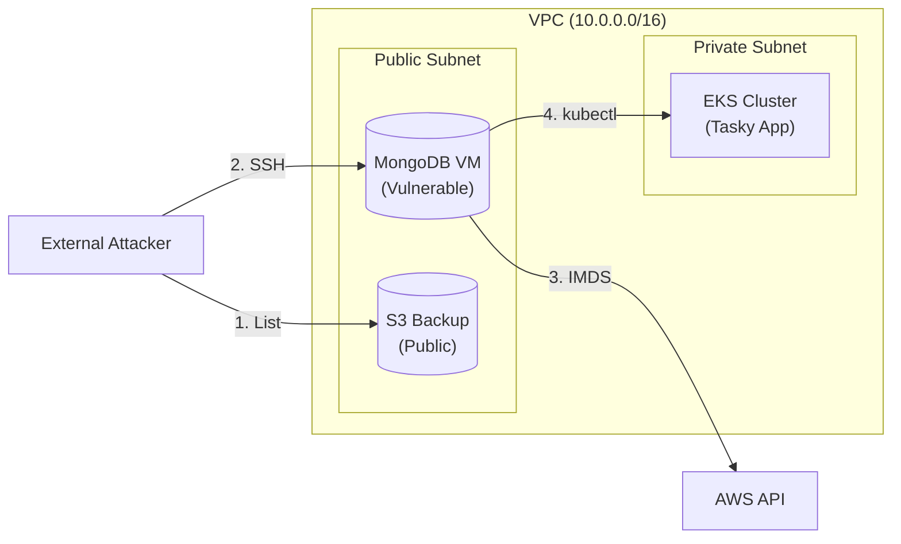

# Wiz Technical Exercise - Demo Overview

**Scenario:** A compromised AWS cloud environment demonstrating the "Kill Chain" from initial foothold to full data exfiltration.

## Architecture

The environment simulates a typical 2-tier application with intentional security flaws.

## Key Components

*   **Tasky App**: A Go-based todo application running on EKS (Kubernetes).
*   **MongoDB VM**: An outdated database server (Ubuntu 20.04) acting as the pivot point.
*   **S3 Buckets**: Stores database backups (and the initial leak).
*   **Red Team Instance**: The "attacker" machine inside the VPC (simulating a compromised host or external actor).
*   **Wazuh SIEM**: The Blue Team dashboard monitoring for threats.

## The Attack Story

1.  **Initial Access**: The attacker finds a public S3 bucket containing sensitive info or uses leaked credentials to find the environment.
2.  **Reconnaissance**: Using the Red Team instance, they scan the internal network and find an exposed MongoDB server.
3.  **Lateral Movement**: They obtain an SSH key (via SSM or S3) and jump to the MongoDB VM.
4.  **Privilege Escalation**: The MongoDB VM has an attached IAM Role that is **overprivileged** and **IMDSv1** is enabled. The attacker steals these credentials.
5.  **Full Compromise**: Using the stolen AWS credentials, the attacker accesses the private EKS cluster, dumps secrets, and exfiltrates the entire customer database.

## Vulnerabilities Demonstrated

| Vulnerability | Why it matters |
|---------------|----------------|
| **Public S3 Bucket** | Simple misconfiguration leading to data leak. |
| **Exposed SSH** | Management ports open to the world (0.0.0.0/0). |
| **Overprivileged IAM** | "Wildcard" permissions (`ec2:*`, `s3:*`) allow total control. |
| **IMDSv1 Enabled** | Allows simple SSRF attacks to steal cloud identity. |
| **K8s Secrets** | Secrets stored unencrypted (base64) and accessible via broad RBAC. |

## Detection (Blue Team)

Throughout the demo, **Wazuh** and **GuardDuty** are watching.

*   **Look for:** "Unauthenticated S3 Access"
*   **Look for:** "SSH Brute Force" or "Lateral Movement"
*   **Critical Alert:** "IMDS Credential Theft" (Stealing the identity)
*   **Critical Alert:** "Kubernetes Secret Access"

---

*Use this guide to narrate the flow while the automated script runs in the background.*
