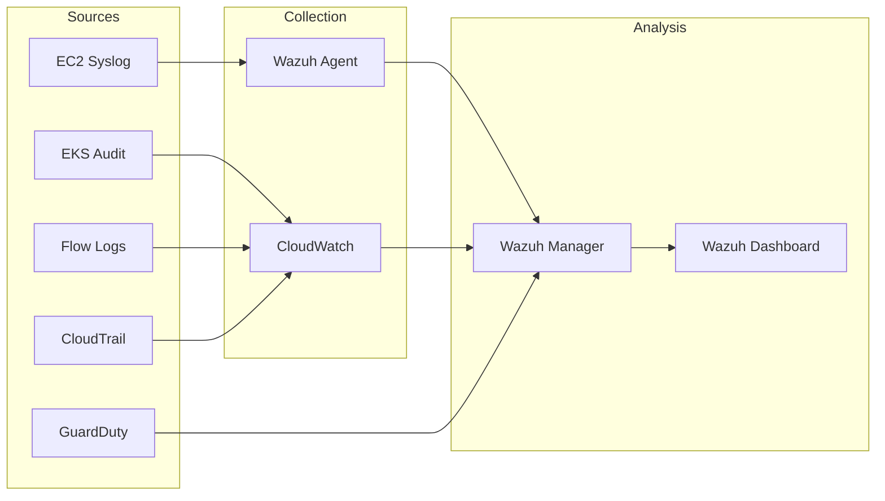
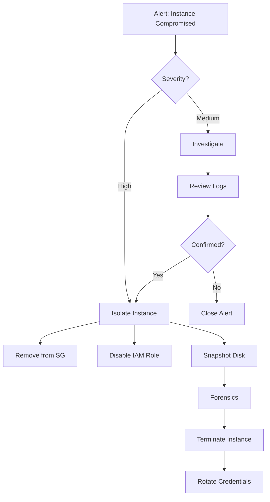

# Detection & Response

This guide covers how to detect the attacks demonstrated in this exercise using Wazuh SIEM and AWS security services.

## Accessing Wazuh

### Dashboard Access

```bash
# Get Wazuh IP
make demo-wazuh
```

Or manually:

```
URL: https://<wazuh-ip>
Username: admin
Password: <from WAZUH_ADMIN_PASS>
```

### First Login

1. Accept the self-signed certificate warning
2. Login with admin credentials
3. Navigate to **Security Events** dashboard

## Detection Sources

### Architecture



## Detecting Each Attack

### WIZ-001: Public S3 Access

#### GuardDuty Finding

```json
{
  "type": "Policy:S3/BucketPublicAccessGranted",
  "severity": "HIGH",
  "title": "S3 bucket is publicly accessible"
}
```

#### CloudTrail Events

Look for unauthenticated access:

```sql
-- CloudWatch Logs Insights
fields @timestamp, eventName, sourceIPAddress, userIdentity.type
| filter eventSource = 's3.amazonaws.com'
| filter userIdentity.type = 'AWSAccount'
| filter userIdentity.accountId = 'ANONYMOUS'
| sort @timestamp desc
```

#### Wazuh Rule

```xml
<rule id="80001" level="10">
  <if_sid>80000</if_sid>
  <field name="aws.source">s3.amazonaws.com</field>
  <field name="aws.userIdentity.type">AWSAccount</field>
  <description>Anonymous S3 access detected</description>
  <group>aws,s3,unauthorized</group>
</rule>
```

### WIZ-003: SSH Brute Force

#### Wazuh Dashboard

Navigate to: **Security Events** → **SSH**

#### Sample Alert

```json
{
  "rule": {
    "id": "5712",
    "level": 10,
    "description": "SSH brute force attack"
  },
  "agent": {
    "name": "mongodb"
  },
  "data": {
    "srcip": "203.0.113.50",
    "dstuser": "root"
  }
}
```

#### Wazuh Rules

```xml
<rule id="5710" level="5">
  <if_sid>5700</if_sid>
  <match>Failed password</match>
  <description>SSH authentication failed</description>
</rule>

<rule id="5712" level="10" frequency="6" timeframe="120">
  <if_matched_sid>5710</if_matched_sid>
  <description>SSH brute force attack detected</description>
</rule>
```

### WIZ-002: IAM Abuse

#### CloudTrail Events

```sql
fields @timestamp, eventName, sourceIPAddress, userIdentity.arn
| filter userIdentity.arn like /mongodb-role/
| filter eventName not in ['GetObject', 'PutObject']
| filter eventSource in ['iam.amazonaws.com', 'ec2.amazonaws.com', 's3.amazonaws.com']
| sort @timestamp desc
```

#### GuardDuty Findings

- `Recon:IAMUser/UserPermissions`
- `Discovery:IAMUser/AnomalousBehavior`

### WIZ-007: IMDS Credential Theft

#### GuardDuty Finding

```json
{
  "type": "UnauthorizedAccess:IAMUser/InstanceCredentialExfiltration.OutsideAWS",
  "severity": "HIGH",
  "description": "Instance credentials used from external IP"
}
```

#### Detection Logic

Credentials were:
1. Issued to instance `i-0abc123`
2. Used from IP `203.0.113.50` (not the instance IP)

### WIZ-004: K8s Cluster-Admin Abuse

#### EKS Audit Logs

```sql
fields @timestamp, user.username, verb, objectRef.resource, objectRef.namespace
| filter user.username = 'system:serviceaccount:tasky:tasky-sa'
| filter objectRef.namespace != 'tasky'
| sort @timestamp desc
```

#### GuardDuty EKS Findings

- `PrivilegeEscalation:Kubernetes/PrivilegedContainer`
- `Policy:Kubernetes/ExposedDashboard`

## Wazuh Configuration

### Agent Installation

On monitored hosts:

```bash
# Download agent
curl -s https://packages.wazuh.com/4.x/apt/pool/main/w/wazuh-agent/wazuh-agent_4.7.0-1_amd64.deb -o wazuh-agent.deb

# Install
sudo WAZUH_MANAGER='<wazuh-ip>' dpkg -i wazuh-agent.deb

# Enable and start
sudo systemctl enable wazuh-agent
sudo systemctl start wazuh-agent
```

### Custom Rules

Add to `/var/ossec/etc/rules/local_rules.xml`:

```xml
<group name="custom,aws,">
  <!-- AWS credential theft -->
  <rule id="100001" level="12">
    <if_group>aws</if_group>
    <field name="aws.eventName">GetCallerIdentity</field>
    <field name="aws.sourceIPAddress">^(?!10\.|172\.|192\.168\.)</field>
    <description>AWS credentials used from external IP</description>
    <group>credential_theft</group>
  </rule>

  <!-- K8s secret access -->
  <rule id="100002" level="10">
    <if_group>kubernetes</if_group>
    <field name="kubernetes.verb">get|list</field>
    <field name="kubernetes.objectRef.resource">secrets</field>
    <description>Kubernetes secret accessed</description>
    <group>secret_access</group>
  </rule>
</group>
```

## Response Playbooks

### Playbook: Compromised EC2 Instance



### Automated Response

Using AWS Lambda:

```python
import boto3

def isolate_instance(event, context):
    ec2 = boto3.client('ec2')
    instance_id = event['detail']['resource']['instanceDetails']['instanceId']

    # Remove from security groups
    ec2.modify_instance_attribute(
        InstanceId=instance_id,
        Groups=['sg-isolation']  # Pre-created isolation SG
    )

    # Disable instance profile
    ec2.disassociate_iam_instance_profile(
        AssociationId=get_association_id(instance_id)
    )

    return {'statusCode': 200}
```

## Alert Correlation

### Timeline View

In Wazuh Dashboard:

1. Go to **Security Events**
2. Filter by agent: `mongodb`
3. Select time range around incident
4. Look for patterns:

```
14:00:00 - SSH login success (unusual IP)
14:00:30 - IMDS access (curl to 169.254.169.254)
14:01:00 - AWS API calls (sts:GetCallerIdentity)
14:02:00 - AWS API calls (s3:ListBuckets)
14:05:00 - AWS API calls from DIFFERENT IP
```

### Attack Chain Detection

```xml
<rule id="100010" level="14">
  <if_matched_group>ssh_success</if_matched_group>
  <if_matched_group>credential_theft</if_matched_group>
  <timeframe>600</timeframe>
  <description>Potential attack chain: SSH access followed by credential theft</description>
  <group>attack_chain</group>
</rule>
```

## Metrics & KPIs

### Security Metrics Dashboard

| Metric | Target | Current |
|--------|--------|---------|
| Mean Time to Detect | < 5 min | Measure |
| Mean Time to Respond | < 30 min | Measure |
| False Positive Rate | < 10% | Measure |
| Alert Coverage | > 90% | Measure |

### Create Dashboard in Wazuh

1. Navigate to **Visualize**
2. Create visualizations:
   - Alert count by severity (pie chart)
   - Alert timeline (line chart)
   - Top attack types (bar chart)
3. Save to dashboard

## Exercises

### Blue Team Exercise 1: Detect S3 Access

1. Run `make demo-s3`
2. Find the detection in Wazuh
3. Identify source IP
4. Determine what data was accessed

### Blue Team Exercise 2: SSH Attack Detection

1. Run `make demo-ssh`
2. Monitor Wazuh for SSH events
3. Correlate login with subsequent activity
4. Build timeline of attacker actions

### Blue Team Exercise 3: Full Attack Response

1. Run the full attack chain
2. Detect each phase
3. Write incident report
4. Propose remediation steps

## Additional Resources

- [Wazuh Documentation](https://documentation.wazuh.com/)
- [AWS GuardDuty Findings](https://docs.aws.amazon.com/guardduty/latest/ug/guardduty_finding-types.html)
- [EKS Security Best Practices](https://aws.github.io/aws-eks-best-practices/security/docs/)
