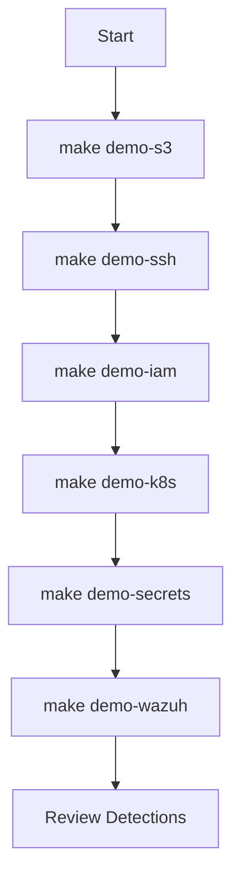

# Demo Overview

This section provides step-by-step attack demonstrations for the Wiz Technical Exercise.

## Available Demos

| Demo | Command | Vulnerability | Difficulty |
|------|---------|---------------|------------|
| [S3 Exfiltration](s3-exfil.md) | `make demo-s3` | Public bucket | Beginner |
| [K8s Exploitation](k8s-exploit.md) | `make demo-k8s` | cluster-admin SA | Intermediate |
| [Privilege Escalation](privesc.md) | `make demo-iam` | Overprivileged IAM | Intermediate |
| [Attack Chain](attack-chain.md) | `make demo-attack` | All combined | Advanced |
| [Detection](detection.md) | Wazuh Dashboard | - | Blue Team |

## Quick Demo Menu

```bash
make demo
```

```
═══════════════════════════════════════════════════════════════
                  VULNERABILITY DEMOS
═══════════════════════════════════════════════════════════════

  1) make demo-s3       - Public S3 bucket access
  2) make demo-ssh      - SSH to exposed MongoDB
  3) make demo-iam      - Overprivileged IAM role
  4) make demo-k8s      - K8s cluster-admin abuse
  5) make demo-secrets  - K8s secrets exposure
  6) make demo-redteam  - SSH to red team instance
  7) make demo-wazuh    - Wazuh SIEM dashboard
  8) make demo-attack   - Full attack chain
```

## Demo Prerequisites

Before running demos, ensure:

1. **Infrastructure is deployed**
   ```bash
   make build
   # or
   make deploy-local
   ```

2. **SSH keys are fetched**
   ```bash
   make ssh-keys
   ```

3. **kubectl is configured** (for K8s demos)
   ```bash
   aws eks update-kubeconfig --name wiz-exercise-eks --region us-east-1
   ```

4. **Verify access**
   ```bash
   make show
   make ssh-info
   ```

## Demo Environment

### Red Team Instance

The Red Team instance (`make ssh-redteam`) comes pre-installed with:

- **Reconnaissance**: nmap, dnsutils, whois
- **AWS Tools**: AWS CLI v2, kubectl
- **Database**: mongosh, mongodb-clients
- **General**: curl, wget, jq, python3

Attack scripts are located at `/opt/redteam/scripts/`:

```
/opt/redteam/
├── env.sh              # Environment variables
├── README.md           # Attack chain documentation
└── scripts/
    ├── 01-recon.sh         # Reconnaissance
    ├── 02-s3-exfil.sh      # S3 data exfiltration
    ├── 03-k8s-exploit.sh   # Kubernetes exploitation
    ├── 04-mongodb-access.sh # MongoDB access
    └── 05-privesc.sh       # Privilege escalation
```

### Using Attack Scripts

```bash
# SSH to Red Team instance
make ssh-redteam

# Load environment
source /opt/redteam/env.sh

# Run attack scripts in sequence
cd /opt/redteam/scripts
./01-recon.sh
./02-s3-exfil.sh
./03-k8s-exploit.sh
./04-mongodb-access.sh
./05-privesc.sh
```

## Demo Flow

### Recommended Order



### Timing Guide

| Demo | Duration | Notes |
|------|----------|-------|
| S3 Exfiltration | 5 min | Quick, visual impact |
| SSH Access | 5 min | Shows exposed surface |
| IAM Abuse | 10 min | Explain permissions |
| K8s Exploitation | 15 min | Multiple steps |
| Secrets Exposure | 5 min | Quick decode |
| Full Attack Chain | 30 min | Complete walkthrough |
| Detection Review | 20 min | Wazuh dashboard |

## Presentation Mode

For live demonstrations, consider:

### Terminal Setup

```bash
# Increase font size
# Use tmux for split views
tmux new-session -d -s demo
tmux split-window -h
tmux select-pane -t 0
```

### Recording

```bash
# Record terminal session
asciinema rec demo.cast

# Play back
asciinema play demo.cast
```

### Color Output

All make commands use colored output:

- 🟢 **Green**: Success, safe operations
- 🔴 **Red**: Vulnerabilities, destructive operations
- 🟡 **Yellow**: Warnings, demos
- 🔵 **Blue**: Information, headers

## Demo Cleanup

After demonstrations:

```bash
# Check for leftover resources
make show

# Remove any attack artifacts
make ssh-mongodb
rm -rf /opt/redteam/loot/  # If created

# Full infrastructure cleanup
make destroy
```

## Safety Notes

!!! warning "Demo Environment Only"
    - Never run these attacks against production systems
    - Ensure you have authorization
    - Use isolated AWS accounts
    - Clean up after demos

## Troubleshooting Demos

### S3 Demo Fails

```bash
# Check bucket exists
aws s3 ls | grep wiz-exercise

# Verify public access
aws s3api get-bucket-policy-status --bucket <bucket-name>
```

### K8s Demo Fails

```bash
# Update kubeconfig
aws eks update-kubeconfig --name wiz-exercise-eks --region us-east-1

# Check connectivity
kubectl cluster-info
kubectl get nodes
```

### SSH Demo Fails

```bash
# Check keys exist
ls -la keys/

# Re-fetch if needed
make ssh-keys

# Test connectivity
nc -zv <ip> 22
```

## Next Steps

- [S3 Exfiltration Demo](s3-exfil.md)
- [Attack Chain Demo](attack-chain.md)
- [Detection & Response](detection.md)
