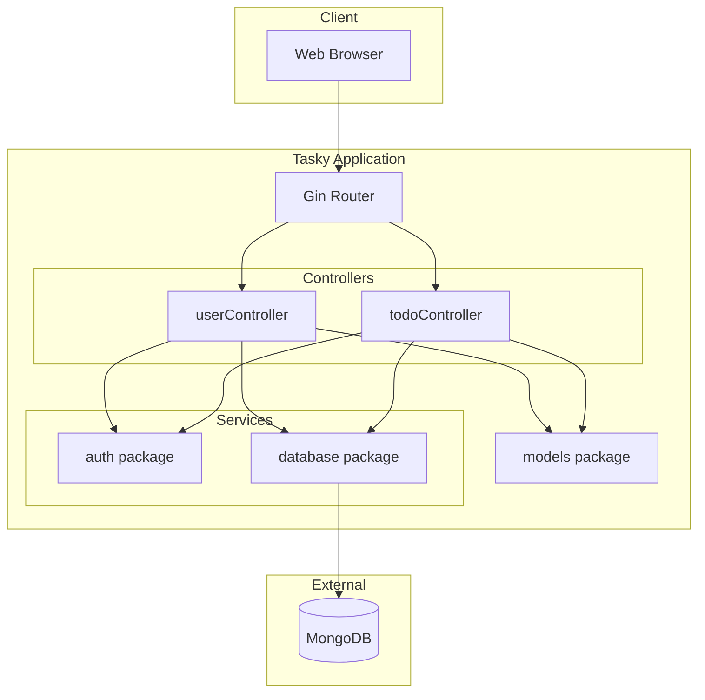
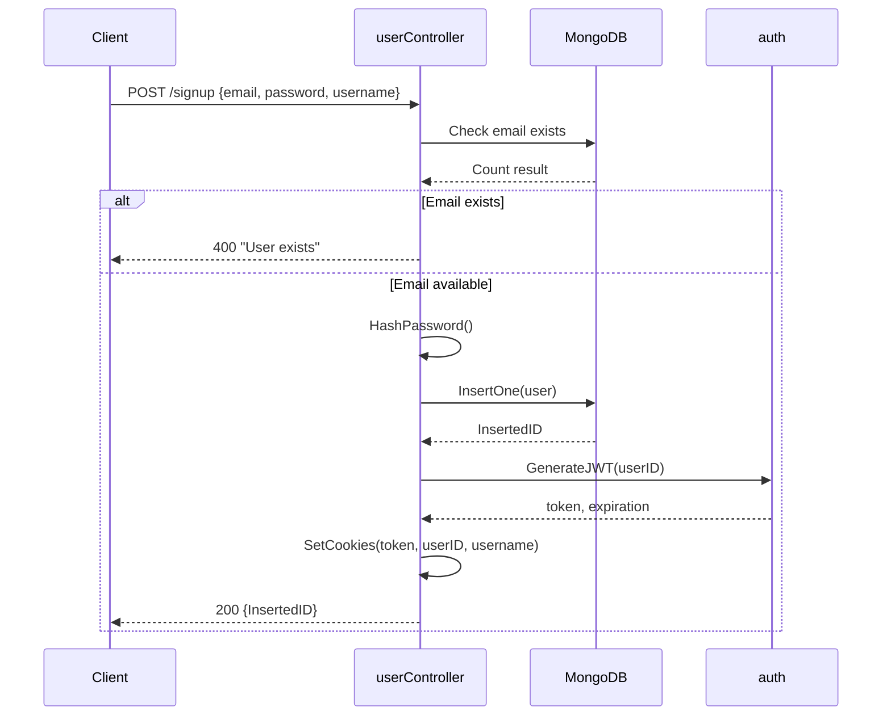
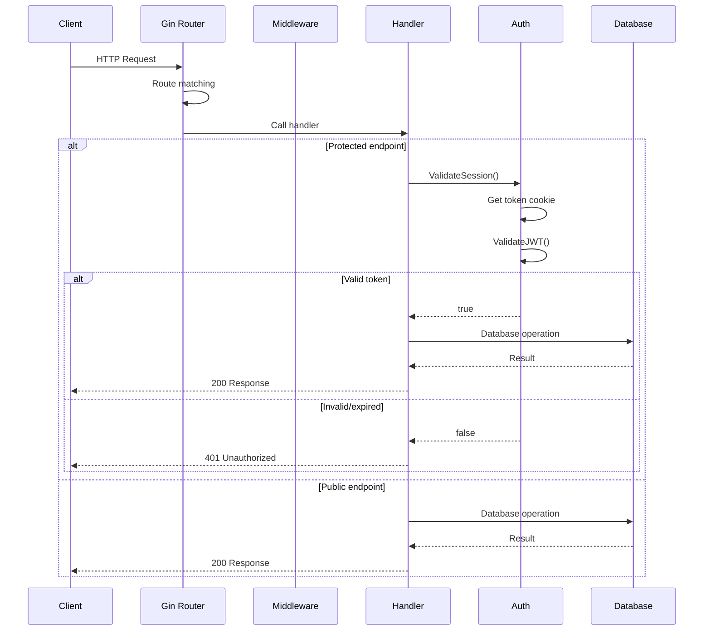

# Application Architecture

This document describes the architecture of the Tasky Go application, including code organization, design patterns, and component interactions.

## Overview

Tasky is a simple todo list application built with:

- **Language**: Go 1.19+
- **Web Framework**: [Gin](https://gin-gonic.com/)
- **Database**: MongoDB 4.4+
- **Authentication**: JWT (JSON Web Tokens)
- **Password Hashing**: bcrypt

## Directory Structure

```
project/app/
├── main.go                 # Application entry point
├── go.mod                  # Go module definition
├── go.sum                  # Dependency checksums
├── Dockerfile              # Container build instructions
├── wizexercise.txt         # Exercise verification file
├── controllers/
│   ├── todoController.go   # Todo CRUD operations
│   └── userController.go   # User auth operations
├── models/
│   └── models.go           # Data structures
├── database/
│   └── database.go         # MongoDB connection
├── auth/
│   └── auth.go             # JWT utilities
└── assets/
    ├── login.html          # Login page template
    └── todo.html           # Todo list template
```

## Component Diagram



## Core Components

### 1. Main Entry Point (`main.go`)

The application entry point configures routes and starts the HTTP server.

**Key Responsibilities:**
- Load environment variables from `.env`
- Initialize Gin router
- Define all HTTP routes
- Serve static assets and HTML templates
- Start HTTP server on port 8080

**Route Table:**

| Method | Path | Handler | Auth Required |
|--------|------|---------|---------------|
| GET | `/` | `index` | No |
| GET | `/health` | `healthCheck` | No |
| GET | `/wizexercise` | `verifyWizExercise` | No |
| POST | `/signup` | `controller.SignUp` | No |
| POST | `/login` | `controller.Login` | No |
| GET | `/todo` | `controller.Todo` | Yes |
| GET | `/todos/:userid` | `controller.GetTodos` | Yes |
| GET | `/todo/:id` | `controller.GetTodo` | No* |
| POST | `/todo/:userid` | `controller.AddTodo` | Yes |
| PUT | `/todo` | `controller.UpdateTodo` | Yes |
| DELETE | `/todo/:userid/:id` | `controller.DeleteTodo` | Yes |
| DELETE | `/todos/:userid` | `controller.ClearAll` | Yes |

*Note: `GetTodo` doesn't check auth - potential security issue.

### 2. Controllers Package

Controllers handle HTTP request/response logic.

#### userController.go

Handles user authentication:

```go
// SignUp - Create new user account
func SignUp(c *gin.Context)

// Login - Authenticate existing user
func Login(c *gin.Context)

// Todo - Render authenticated todo page
func Todo(c *gin.Context)

// HashPassword - bcrypt password hashing
func HashPassword(password string) string

// VerifyPassword - bcrypt password verification
func VerifyPassword(userPassword, providedPassword string) (bool, string)
```

**Flow - User Signup:**


#### todoController.go

Handles CRUD operations for todos:

```go
// GetTodos - List all todos for a user
func GetTodos(c *gin.Context)

// GetTodo - Get single todo by ID
func GetTodo(c *gin.Context)

// AddTodo - Create new todo
func AddTodo(c *gin.Context)

// UpdateTodo - Modify existing todo
func UpdateTodo(c *gin.Context)

// DeleteTodo - Remove single todo
func DeleteTodo(c *gin.Context)

// ClearAll - Remove all todos for user
func ClearAll(c *gin.Context)
```

### 3. Models Package (`models/models.go`)

Defines data structures with BSON/JSON tags for MongoDB serialization.

```go
// Todo represents a todo item
type Todo struct {
    ID     primitive.ObjectID `bson:"_id"`
    Name   string             `json:"name"    bson:"name"`
    Status string             `json:"status"  bson:"status"`
    UserID string             `json:"user_id" bson:"user_id"`
}

// User represents a user account
type User struct {
    ID       primitive.ObjectID `bson:"_id"`
    Name     *string            `json:"username" bson:"username"`
    Email    *string            `json:"email"    bson:"email"`
    Password *string            `json:"password" bson:"password"`
}
```

**Database Collections:**

| Collection | Document Type | Indexes |
|------------|--------------|---------|
| `user` | User | email (unique) |
| `todos` | Todo | userid |

### 4. Database Package (`database/database.go`)

Manages MongoDB connection.

```go
// Client is the global MongoDB client
var Client *mongo.Client = CreateMongoClient()

// CreateMongoClient establishes MongoDB connection
func CreateMongoClient() *mongo.Client

// OpenCollection returns a handle to a collection
func OpenCollection(client *mongo.Client, collectionName string) *mongo.Collection
```

**Configuration:**
- Connection string from `MONGODB_URI` environment variable
- Database name: `go-mongodb`
- Connection timeout: 10 seconds

### 5. Auth Package (`auth/auth.go`)

Handles JWT token generation and validation.

```go
// Claims defines JWT payload structure
type Claims struct {
    Username string `json:"username"`
    jwt.StandardClaims
}

// ValidateSession checks if request has valid JWT
func ValidateSession(c *gin.Context) bool

// GenerateJWT creates a new JWT token
func GenerateJWT(userid string) (string, error, time.Time)

// ValidateJWT parses and validates a token
func ValidateJWT(token string) (jwt.Token, error)

// RefreshToken determines if token needs refresh
func RefreshToken(c *gin.Context) (bool, error, time.Time)
```

**JWT Configuration:**
- Algorithm: HS256
- Expiration: 5 minutes
- Secret: `SECRET_KEY` environment variable

## Request Lifecycle



## Environment Variables

| Variable | Description | Required |
|----------|-------------|----------|
| `MONGODB_URI` | MongoDB connection string | Yes |
| `SECRET_KEY` | JWT signing secret | Yes |
| `PORT` | Server port (default: 8080) | No |

Example `.env`:
```bash
MONGODB_URI=mongodb://localhost:27017/tasky
SECRET_KEY=your-secret-key-here
PORT=8080
```

## Error Handling

The application uses Gin's built-in error handling:

```go
// Return error response
c.JSON(http.StatusInternalServerError, gin.H{"error": err.Error()})

// Return success response
c.JSON(http.StatusOK, gin.H{"success": "Operation completed"})
```

Error response format:
```json
{
  "error": "Description of what went wrong"
}
```

## Security Considerations

### Known Vulnerabilities (Intentional)

1. **Secrets in Environment Variables (WIZ-005)**
   - JWT secret stored in plain environment variable
   - Exposed via Kubernetes secrets

2. **Missing Security Headers**
   - No CORS configuration
   - No CSP headers
   - Cookies without Secure/HttpOnly flags

3. **Authentication Gaps**
   - `GetTodo` endpoint doesn't validate session
   - No rate limiting
   - No account lockout

### Password Security

Passwords are hashed using bcrypt with cost factor 14:
```go
bcrypt.GenerateFromPassword([]byte(password), 14)
```

## Extending the Application

### Adding a New Endpoint

1. Define handler in appropriate controller:
```go
// controllers/todoController.go
func ArchiveTodo(c *gin.Context) {
    session := auth.ValidateSession(c)
    if !session {
        return
    }
    // Implementation
}
```

2. Register route in `main.go`:
```go
router.PUT("/todo/:id/archive", controller.ArchiveTodo)
```

### Adding a New Model

1. Define struct in `models/models.go`:
```go
type Category struct {
    ID     primitive.ObjectID `bson:"_id"`
    Name   string             `json:"name" bson:"name"`
    UserID string             `json:"user_id" bson:"user_id"`
}
```

2. Create controller file
3. Add collection reference
4. Register routes

## Dependencies

Key dependencies in `go.mod`:

| Package | Version | Purpose |
|---------|---------|---------|
| `github.com/gin-gonic/gin` | v1.9+ | Web framework |
| `go.mongodb.org/mongo-driver` | v1.12+ | MongoDB driver |
| `github.com/dgrijalva/jwt-go` | v3.2+ | JWT handling |
| `golang.org/x/crypto` | latest | bcrypt |
| `github.com/joho/godotenv` | v1.5+ | Env file loading |

## Related Documentation

- [API Reference](../reference/api.md)
- [Local Development Setup](local-setup.md)
- [Container Build](../build/container.md)
- [Application Testing](../testing/application-tests.md)
