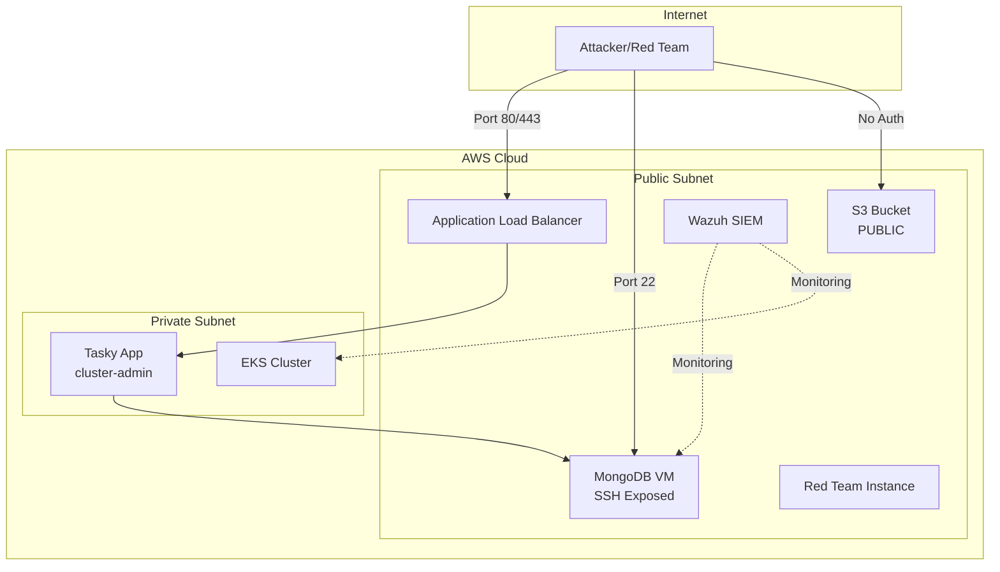

# Wiz Technical Exercise

<div align="center">
  <h2>Deliberately Vulnerable AWS Infrastructure for Security Training</h2>
  <p><em>A comprehensive security exercise demonstrating cloud misconfigurations and attack vectors</em></p>
</div>

---

## Overview

This project deploys a **deliberately vulnerable** two-tier web application to AWS, designed to demonstrate common cloud security misconfigurations and their exploitation. It serves as a training environment for:

- **Red Team** exercises and penetration testing
- **Blue Team** detection and response training
- **Security Architecture** review and hardening practice
- **Compliance** gap analysis demonstrations

!!! danger "Warning: Intentionally Vulnerable"
    This infrastructure contains **intentional security vulnerabilities** for educational purposes.
    **Never deploy to production environments.** Always use isolated AWS accounts for testing.

## Architecture at a Glance



## Key Vulnerabilities

| Vulnerability | Severity | Component | Detection |
|--------------|----------|-----------|-----------|
| Public S3 Bucket | Critical | S3 | GuardDuty, Security Hub |
| Overprivileged IAM | Critical | MongoDB VM | IAM Access Analyzer |
| Exposed SSH | High | MongoDB VM | GuardDuty, VPC Flow Logs |
| Cluster-Admin SA | Critical | EKS | GuardDuty EKS |
| Plaintext Secrets | High | Kubernetes | Wazuh, Security Hub |
| Outdated MongoDB | Medium | MongoDB VM | Inspector, Wazuh |
| IMDS v1 Enabled | High | EC2 | GuardDuty |

## Quick Start

=== "GitHub Actions (Recommended)"

    ```bash
    # Clone the repository
    git clone https://github.com/evanspangler/wiz-technical-exercise.git
    cd wiz-technical-exercise

    # Configure secrets and deploy
    make secrets
    make build
    ```

=== "Local Deployment"

    ```bash
    # Clone and configure
    git clone https://github.com/evanspangler/wiz-technical-exercise.git
    cd wiz-technical-exercise
    cp .env.example .env
    # Edit .env with your AWS credentials

    # Deploy
    make deploy-local
    ```

## Features

### Infrastructure Components

- **EKS Cluster** - Managed Kubernetes with deliberately misconfigured RBAC
- **MongoDB VM** - EC2 instance with overprivileged IAM role and exposed SSH
- **Wazuh SIEM** - Security monitoring and detection platform
- **Red Team Instance** - Pre-configured attack tools and scripts
- **S3 Bucket** - Publicly accessible backup storage

### Automation

- **Makefile** - Single command deployment, demos, and teardown
- **GitHub Actions** - CI/CD pipeline for infrastructure management
- **Terraform** - Infrastructure as Code with modular design
- **Attack Scripts** - Pre-built exploitation tools on Red Team instance

### Monitoring & Detection

- **Wazuh** - Host-based intrusion detection and log analysis
- **AWS GuardDuty** - Threat detection for AWS accounts
- **CloudTrail** - API activity logging
- **VPC Flow Logs** - Network traffic analysis

## Documentation Structure

| Section | Description |
|---------|-------------|
| [Getting Started](getting-started/quickstart.md) | Setup, prerequisites, and first deployment |
| [Architecture](architecture/overview.md) | System design, network topology, data flows |
| [Infrastructure](infrastructure/eks.md) | Detailed component documentation |
| [Security](security/overview.md) | Vulnerability details and exploitation |
| [Demos](demos/overview.md) | Attack scenarios and detection exercises |
| [Reference](reference/makefile.md) | Commands, variables, and API reference |
| [Troubleshooting](troubleshooting/common-issues.md) | Common issues and solutions |

## Project Structure

```
wiz-technical-exercise/
├── .github/
│   └── workflows/
│       └── deploy.yml          # GitHub Actions workflow
├── docs/                       # MkDocs documentation
├── k8s/                        # Kubernetes manifests
│   ├── namespace.yaml
│   ├── deployment.yaml
│   ├── service.yaml
│   └── secrets.yaml
├── terraform/
│   ├── bootstrap/              # S3 backend setup
│   ├── environments/           # Environment configs
│   └── modules/
│       ├── eks/                # EKS cluster
│       ├── mongodb-vm/         # MongoDB EC2
│       ├── networking/         # VPC, subnets
│       ├── redteam/            # Red team instance
│       ├── s3-backup/          # S3 bucket
│       └── wazuh/              # Wazuh SIEM
├── .env.example                # Environment template
├── Makefile                    # Build automation
└── mkdocs.yml                  # Documentation config
```

## Cost Estimate

!!! info "AWS Costs"
    Running this infrastructure will incur AWS charges. Estimated costs:

    - **EKS Cluster**: ~$0.10/hour ($72/month)
    - **EC2 Instances**: ~$0.05/hour ($36/month for 3 instances)
    - **NAT Gateway**: ~$0.045/hour ($32/month)
    - **Data Transfer**: Variable

    **Total**: ~$140-200/month if running 24/7

    Use `make destroy` when not in use to minimize costs.

## Support

- **Issues**: [GitHub Issues](https://github.com/evanspangler/wiz-technical-exercise/issues)
- **Documentation**: This site
- **Author**: Evan Spangler

## License

This project is provided for educational purposes. Use responsibly and only in authorized environments.
