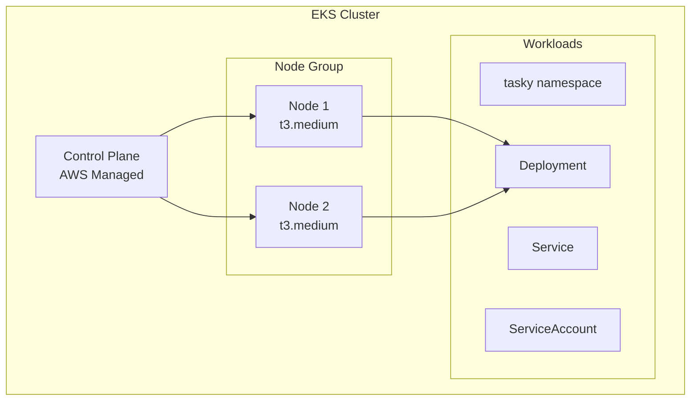

# EKS Cluster

Detailed documentation of the Amazon EKS cluster configuration.

## Overview

| Property | Value |
|----------|-------|
| Cluster Name | `wiz-exercise-eks` |
| Kubernetes Version | 1.28 |
| Node Instance Type | t3.medium |
| Node Count | 2 (desired) |
| Node Group | Managed |

## Architecture



## Terraform Module

Located at: `terraform/modules/eks/`

```hcl
module "eks" {
  source = "./modules/eks"

  cluster_name    = "${var.project_name}-eks"
  cluster_version = var.eks_cluster_version

  vpc_id     = module.networking.vpc_id
  subnet_ids = module.networking.private_subnet_ids

  node_instance_type = var.eks_node_instance_type
  node_desired_size  = var.eks_node_desired_size
  node_min_size      = var.eks_node_min_size
  node_max_size      = var.eks_node_max_size
}
```

## Kubernetes Resources

### Namespace

```yaml
apiVersion: v1
kind: Namespace
metadata:
  name: tasky
```

### Deployment

```yaml
apiVersion: apps/v1
kind: Deployment
metadata:
  name: tasky
  namespace: tasky
spec:
  replicas: 2
  selector:
    matchLabels:
      app: tasky
  template:
    spec:
      serviceAccountName: tasky-sa
      containers:
      - name: tasky
        image: nginx:latest
        ports:
        - containerPort: 80
        envFrom:
        - secretRef:
            name: mongodb-credentials
```

### Service

```yaml
apiVersion: v1
kind: Service
metadata:
  name: tasky-service
  namespace: tasky
spec:
  type: LoadBalancer
  ports:
  - port: 80
    targetPort: 80
  selector:
    app: tasky
```

## Security Configuration

### RBAC (Vulnerable)

The ServiceAccount has cluster-admin permissions - see [WIZ-004](../security/k8s-cluster-admin.md).

### Network Policies

Currently no network policies are applied (intentional vulnerability).

### Pod Security

No Pod Security Standards are enforced.

## Access

### Configure kubectl

```bash
aws eks update-kubeconfig --name wiz-exercise-eks --region us-east-1
```

### Verify Access

```bash
kubectl cluster-info
kubectl get nodes
kubectl get pods -n tasky
```

## Monitoring

### CloudWatch Container Insights

Logs are sent to CloudWatch Log Groups:

- `/aws/eks/wiz-exercise-eks/cluster`

### Metrics

Available via CloudWatch:

- Node CPU/Memory utilization
- Pod count
- Network traffic

## Outputs

| Output | Description |
|--------|-------------|
| `cluster_endpoint` | EKS API endpoint |
| `cluster_name` | Cluster name |
| `cluster_certificate` | CA certificate |

## Related Documentation

- [Security: K8s Cluster-Admin](../security/k8s-cluster-admin.md)
- [Security: Secrets Exposure](../security/secrets-exposure.md)
- [Demo: K8s Exploitation](../demos/k8s-exploit.md)
