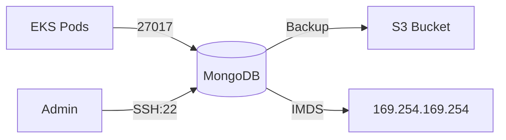

# MongoDB VM

Documentation for the MongoDB EC2 instance configuration.

## Overview

| Property | Value |
|----------|-------|
| Instance Type | t3.small |
| AMI | Ubuntu 22.04 LTS |
| MongoDB Version | 4.4.29 (intentionally outdated) |
| Storage | 20 GB gp3 EBS |

## Architecture



## Terraform Module

Located at: `terraform/modules/mongodb-vm/`

### Key Resources

- `aws_instance.mongodb` - EC2 instance
- `aws_security_group.mongodb` - Security group
- `aws_iam_role.mongodb` - Instance role (overprivileged)
- `aws_iam_instance_profile.mongodb` - Instance profile

## Configuration

### User Data Script

The instance is configured via user data script (`templates/mongodb-userdata.sh.tpl`):

1. System updates
2. SSH hardening (public key only)
3. MongoDB 4.4 installation
4. User creation (admin + app user)
5. Backup script setup
6. Cron job for daily backups

### MongoDB Configuration

```yaml
# /etc/mongod.conf
storage:
  dbPath: /var/lib/mongodb
net:
  port: 27017
  bindIp: 0.0.0.0
security:
  authorization: enabled
```

## Security Issues

### Intentional Vulnerabilities

| Vulnerability | ID | Description |
|---------------|-----|-------------|
| Exposed SSH | WIZ-003 | Port 22 open to 0.0.0.0/0 |
| Overprivileged IAM | WIZ-002 | Full S3, EC2, IAM, Secrets access |
| Outdated Version | WIZ-006 | MongoDB 4.4 is EOL |
| IMDSv1 | WIZ-007 | Metadata service v1 enabled |

### IAM Role Permissions

The instance role has (intentionally) excessive permissions:

```json
{
  "Action": ["s3:*", "ec2:Describe*", "iam:Get*", "iam:List*", "secretsmanager:GetSecretValue"],
  "Resource": "*"
}
```

## Access

### SSH Access

```bash
make ssh-mongodb
# or
ssh -i keys/mongodb.pem ubuntu@<public-ip>
```

### MongoDB Shell

```bash
# As admin
mongosh -u admin -p '<password>' --authenticationDatabase admin

# As app user
mongosh -u tasky -p '<password>' tasky
```

## Backup System

### Backup Script

Located at `/usr/local/bin/mongodb-backup.sh`:

1. Creates mongodump
2. Compresses with tar/gzip
3. Optionally encrypts with GPG
4. Uploads to S3

### Schedule

Daily at 2 AM via cron:

```cron
0 2 * * * root /usr/local/bin/mongodb-backup.sh
```

## Monitoring

### Wazuh Agent

The instance should have Wazuh agent installed for:

- SSH authentication monitoring
- File integrity monitoring
- Log analysis

### CloudWatch

- CloudWatch agent for metrics
- System logs in CloudWatch Logs

## Outputs

| Output | Description |
|--------|-------------|
| `mongodb_public_ip` | Public IP address |
| `mongodb_private_ip` | Private IP address |
| `mongodb_instance_id` | EC2 instance ID |

## Related Documentation

- [Security: Exposed SSH](../security/ssh-exposed.md)
- [Security: Overprivileged IAM](../security/iam-overprivileged.md)
- [Security: Outdated MongoDB](../security/mongodb-outdated.md)
- [Security: IMDS Exploitation](../security/imds.md)
