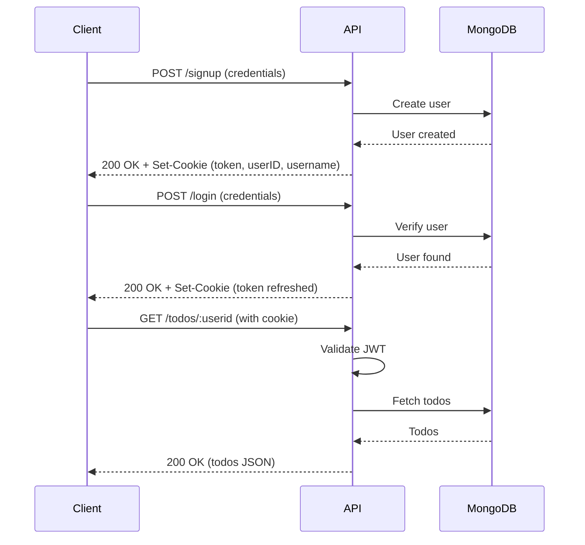

# API Reference

This document provides complete API documentation for the Tasky application.

## Overview

Tasky is a RESTful API built with Go and the Gin web framework. It provides endpoints for user authentication and todo management.

**Base URL:** `http://localhost:8080` (local) or `https://<alb-dns>/` (deployed)

## Authentication

Tasky uses JWT (JSON Web Tokens) for authentication. Tokens are stored in HTTP cookies.

### Authentication Flow



### Cookies

| Cookie | Description | Expiration |
|--------|-------------|------------|
| `token` | JWT authentication token | 5 minutes |
| `userID` | User's MongoDB ObjectID | 5 minutes |
| `username` | User's display name | 5 minutes |

## Endpoints

### Health & System

#### GET /health

Health check endpoint for load balancers and monitoring.

**Request:**
```bash
curl http://localhost:8080/health
```

**Response:**
```json
{
  "status": "healthy",
  "app": "tasky"
}
```

| Status Code | Description |
|-------------|-------------|
| 200 | Application is healthy |

---

#### GET /wizexercise

Verifies the presence of the wizexercise.txt file (exercise requirement).

**Request:**
```bash
curl http://localhost:8080/wizexercise
```

**Response (Success):**
```json
{
  "status": "verified",
  "content": "Wiz Technical Exercise - Evan Spangler"
}
```

**Response (Not Found):**
```json
{
  "error": "wizexercise.txt not found"
}
```

| Status Code | Description |
|-------------|-------------|
| 200 | File exists and verified |
| 404 | File not found |

---

### Authentication

#### POST /signup

Register a new user account.

**Request:**
```bash
curl -X POST http://localhost:8080/signup \
  -H "Content-Type: application/json" \
  -d '{
    "username": "john_doe",
    "email": "john@example.com",
    "password": "securepassword123"
  }'
```

**Request Body:**
| Field | Type | Required | Description |
|-------|------|----------|-------------|
| `username` | string | Yes | Display name |
| `email` | string | Yes | Unique email address |
| `password` | string | Yes | Password (will be hashed) |

**Response (Success):**
```json
{
  "InsertedID": "507f1f77bcf86cd799439011"
}
```

**Response (Email Exists):**
```json
{
  "error": "User with this email already exists!"
}
```

| Status Code | Description |
|-------------|-------------|
| 200 | User created successfully |
| 400 | Email already exists or invalid input |
| 500 | Server error |

**Cookies Set:** `token`, `userID`, `username`

---

#### POST /login

Authenticate an existing user.

**Request:**
```bash
curl -X POST http://localhost:8080/login \
  -H "Content-Type: application/json" \
  -d '{
    "email": "john@example.com",
    "password": "securepassword123"
  }'
```

**Request Body:**
| Field | Type | Required | Description |
|-------|------|----------|-------------|
| `email` | string | Yes | Registered email |
| `password` | string | Yes | Account password |

**Response (Success):**
```json
{
  "msg": "login successful"
}
```

**Response (Invalid Credentials):**
```json
{
  "error": "email or password is incorrect"
}
```

| Status Code | Description |
|-------------|-------------|
| 200 | Login successful |
| 500 | Invalid credentials or server error |

**Cookies Set:** `token` (refreshed), `userID`, `username`

---

#### GET /todo

Render the todo list page (requires authentication).

**Request:**
```bash
curl http://localhost:8080/todo \
  -b "token=<jwt_token>"
```

| Status Code | Description |
|-------------|-------------|
| 200 | Returns todo.html page |
| 401 | Session expired or invalid |

---

### Todos

All todo endpoints require authentication via the `token` cookie.

#### GET /todos/:userid

Get all todos for a user.

**Request:**
```bash
curl http://localhost:8080/todos/507f1f77bcf86cd799439011 \
  -b "token=<jwt_token>"
```

**Path Parameters:**
| Parameter | Type | Description |
|-----------|------|-------------|
| `userid` | string | User's MongoDB ObjectID |

**Response:**
```json
[
  {
    "_id": "507f1f77bcf86cd799439012",
    "name": "Buy groceries",
    "status": "pending",
    "user_id": "507f1f77bcf86cd799439011"
  },
  {
    "_id": "507f1f77bcf86cd799439013",
    "name": "Complete project",
    "status": "completed",
    "user_id": "507f1f77bcf86cd799439011"
  }
]
```

| Status Code | Description |
|-------------|-------------|
| 200 | Returns array of todos |
| 401 | Unauthorized |
| 500 | Server error |

---

#### GET /todo/:id

Get a single todo by ID.

**Request:**
```bash
curl http://localhost:8080/todo/507f1f77bcf86cd799439012 \
  -b "token=<jwt_token>"
```

**Path Parameters:**
| Parameter | Type | Description |
|-----------|------|-------------|
| `id` | string | Todo's MongoDB ObjectID |

**Response:**
```json
{
  "_id": "507f1f77bcf86cd799439012",
  "name": "Buy groceries",
  "status": "pending",
  "user_id": "507f1f77bcf86cd799439011"
}
```

| Status Code | Description |
|-------------|-------------|
| 200 | Returns todo object |
| 500 | Todo not found or server error |

---

#### POST /todo/:userid

Create a new todo.

**Request:**
```bash
curl -X POST http://localhost:8080/todo/507f1f77bcf86cd799439011 \
  -H "Content-Type: application/json" \
  -b "token=<jwt_token>" \
  -d '{
    "name": "New task",
    "status": "pending"
  }'
```

**Path Parameters:**
| Parameter | Type | Description |
|-----------|------|-------------|
| `userid` | string | User's MongoDB ObjectID |

**Request Body:**
| Field | Type | Required | Description |
|-------|------|----------|-------------|
| `name` | string | Yes | Todo description |
| `status` | string | No | Status (default: empty) |

**Response:**
```json
{
  "insertedId": "507f1f77bcf86cd799439014"
}
```

| Status Code | Description |
|-------------|-------------|
| 200 | Todo created successfully |
| 400 | Invalid request body |
| 401 | Unauthorized |
| 500 | Server error |

---

#### PUT /todo

Update an existing todo.

**Request:**
```bash
curl -X PUT http://localhost:8080/todo \
  -H "Content-Type: application/json" \
  -b "token=<jwt_token>" \
  -d '{
    "_id": "507f1f77bcf86cd799439012",
    "name": "Buy groceries and cook dinner",
    "status": "in_progress",
    "user_id": "507f1f77bcf86cd799439011"
  }'
```

**Request Body:**
| Field | Type | Required | Description |
|-------|------|----------|-------------|
| `_id` | string | Yes | Todo's MongoDB ObjectID |
| `name` | string | Yes | Updated description |
| `status` | string | Yes | Updated status |
| `user_id` | string | Yes | Owner's user ID |

**Response:**
```json
{
  "_id": "507f1f77bcf86cd799439012",
  "name": "Buy groceries and cook dinner",
  "status": "in_progress",
  "user_id": "507f1f77bcf86cd799439011"
}
```

| Status Code | Description |
|-------------|-------------|
| 200 | Todo updated successfully |
| 400 | Invalid request body |
| 401 | Unauthorized |
| 500 | Server error |

---

#### DELETE /todo/:userid/:id

Delete a single todo.

**Request:**
```bash
curl -X DELETE http://localhost:8080/todo/507f1f77bcf86cd799439011/507f1f77bcf86cd799439012 \
  -b "token=<jwt_token>"
```

**Path Parameters:**
| Parameter | Type | Description |
|-----------|------|-------------|
| `userid` | string | User's MongoDB ObjectID |
| `id` | string | Todo's MongoDB ObjectID |

**Response (Success):**
```json
{
  "success": "todo with id : 507f1f77bcf86cd799439012 was deleted successfully."
}
```

**Response (Not Found):**
```json
{
  "error": "No todo with id : 507f1f77bcf86cd799439012 was found, no deletion occurred."
}
```

| Status Code | Description |
|-------------|-------------|
| 200 | Todo deleted successfully |
| 400 | Todo not found |
| 401 | Unauthorized |
| 500 | Server error |

---

#### DELETE /todos/:userid

Delete all todos for a user.

**Request:**
```bash
curl -X DELETE http://localhost:8080/todos/507f1f77bcf86cd799439011 \
  -b "token=<jwt_token>"
```

**Path Parameters:**
| Parameter | Type | Description |
|-----------|------|-------------|
| `userid` | string | User's MongoDB ObjectID |

**Response:**
```json
{
  "success": "All todos deleted."
}
```

| Status Code | Description |
|-------------|-------------|
| 200 | All todos deleted |
| 401 | Unauthorized |
| 500 | Server error |

---

## Data Models

### User

```json
{
  "_id": "ObjectID",
  "username": "string",
  "email": "string",
  "password": "string (bcrypt hash)"
}
```

### Todo

```json
{
  "_id": "ObjectID",
  "name": "string",
  "status": "string",
  "user_id": "string"
}
```

## Error Responses

All error responses follow this format:

```json
{
  "error": "Error message describing what went wrong"
}
```

Common error messages:

| Error | Meaning |
|-------|---------|
| `session expired, please login again` | JWT token expired |
| `Unauthorized, signature invalid` | Invalid JWT signature |
| `Unauthorized, invalid token` | Malformed token |
| `email or password is incorrect` | Login failed |
| `User with this email already exists!` | Duplicate signup |

## Rate Limiting

Currently, no rate limiting is implemented. This is an intentional simplification for the exercise.

## Security Considerations

> **Warning**: This API has intentional security vulnerabilities for educational purposes.

Known security issues:
- JWT secret from environment variable (WIZ-005)
- No HTTPS enforcement
- No CSRF protection
- Session cookies without Secure/HttpOnly flags

See [Security Overview](../security/overview.md) for details.

## Related Documentation

- [Application Architecture](../development/application-architecture.md)
- [Local Development](../development/local-setup.md)
- [Secrets Exposure (WIZ-005)](../security/secrets-exposure.md)
