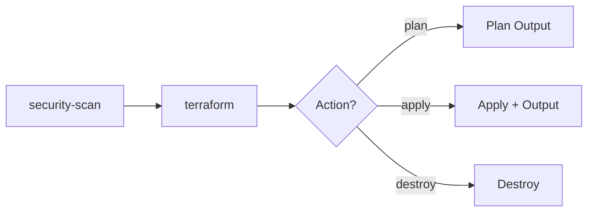
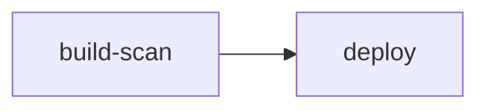
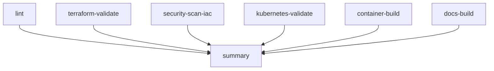

# GitHub Actions

Complete reference for the CI/CD workflows in the Wiz Technical Exercise.

## Workflows Overview

| Workflow | File | Purpose |
|----------|------|---------|
| Deploy Infrastructure | `deploy-infra.yml` | Terraform plan/apply/destroy |
| Build and Deploy App | `build-deploy-app.yml` | Container build, scan, and deploy |
| Test Suite | `test.yml` | Comprehensive testing and validation |

## Deploy Infrastructure

**File:** `.github/workflows/deploy-infra.yml`

### Triggers

- **Push to main/master** - Auto-deploys on terraform changes
- **Pull Request** - Runs plan only
- **Manual dispatch** - Choose action (plan, apply, destroy)

### Usage

```bash
# Deploy infrastructure
make build
# or
gh workflow run "Deploy Infrastructure" --field action=apply

# Destroy infrastructure
make destroy
# or
gh workflow run "Deploy Infrastructure" --field action=destroy

# Plan only
gh workflow run "Deploy Infrastructure" --field action=plan
```

### Jobs



1. **security-scan** - Runs tfsec and checkov on Terraform code
2. **terraform** - Init, validate, plan, and optionally apply/destroy

### Security Scanning

The workflow includes IaC security scanning:

- **tfsec** - Terraform security scanner
- **checkov** - Policy-as-code framework

!!! note "Soft Fail"
    Security scans are configured to soft-fail since the infrastructure is intentionally vulnerable.

## Build and Deploy App

**File:** `.github/workflows/build-deploy-app.yml`

### Triggers

- **Push to main** - On changes to `app/**`
- **Pull Request** - On changes to `app/**`
- **Manual dispatch**

### Jobs



1. **build-scan**
   - Build Docker image
   - Verify wizexercise.txt exists
   - Trivy vulnerability scan
   - Grype vulnerability scan
   - Push to ECR (main branch only)

2. **deploy** (main branch only)
   - Update kubeconfig
   - Deploy to Kubernetes
   - Smoke test
   - kubeaudit security scan

### Container Security

The workflow performs multiple container scans:

| Tool | Purpose | Output |
|------|---------|--------|
| Trivy | CVE scanning | SARIF to Security tab |
| Grype | Vulnerability scanning | SARIF to Security tab |

### wizexercise.txt Verification

The workflow verifies the required `wizexercise.txt` file exists in the container:

```yaml
- name: Verify wizexercise.txt exists
  run: |
    docker run --rm $IMAGE cat /app/wizexercise.txt
    echo "wizexercise.txt verification passed!"
```

## Test Suite

**File:** `.github/workflows/test.yml`

### Triggers

- **Push to main/master**
- **Pull Request to main/master**
- **Manual dispatch**

### Jobs



1. **lint** - Format and style checks
   - Terraform format
   - YAML lint
   - Markdown lint

2. **terraform-validate** - Terraform validation
   - Init (no backend)
   - Validate

3. **security-scan-iac** - IaC security scans
   - tfsec (SARIF output)
   - checkov (SARIF output)
   - Trivy config scan

4. **kubernetes-validate** - K8s manifest validation
   - kubeconform validation
   - kubeaudit security audit

5. **container-build** - Container build and scan
   - Docker build
   - wizexercise.txt verification
   - Trivy container scan
   - Grype container scan

6. **docs-build** - Documentation validation
   - MkDocs strict build
   - Artifact upload

7. **summary** - Aggregate results

### Security Findings

All security scan results are uploaded to the GitHub Security tab as SARIF files:

- Navigate to **Security > Code scanning alerts**
- View findings by category (tfsec, checkov, trivy, grype)

## Required Secrets

Configure in GitHub Settings → Secrets and variables → Actions:

| Secret | Required | Description |
|--------|----------|-------------|
| `AWS_ACCESS_KEY_ID` | Yes | AWS access key ID |
| `AWS_SECRET_ACCESS_KEY` | Yes | AWS secret access key |
| `MONGODB_ADMIN_PASS` | Yes | MongoDB admin password |
| `MONGODB_APP_PASS` | Yes | MongoDB app password |
| `BACKUP_ENCRYPTION_KEY` | No | Backup encryption key |
| `WAZUH_ADMIN_PASS` | No | Wazuh dashboard password |
| `WAZUH_API_PASS` | No | Wazuh API password |

### Setup Secrets

```bash
# Using Makefile (recommended)
make secrets

# Or manually with gh CLI
gh secret set AWS_ACCESS_KEY_ID --body "your-access-key"
gh secret set AWS_SECRET_ACCESS_KEY --body "your-secret-key"
gh secret set MONGODB_ADMIN_PASS --body "$(openssl rand -base64 16)"
gh secret set MONGODB_APP_PASS --body "$(openssl rand -base64 16)"
```

## Repository Variables

Optional variables in Settings → Variables:

| Variable | Default | Description |
|----------|---------|-------------|
| `CONTAINER_IMAGE` | `nginx:latest` | Default container image |

## Monitoring Workflows

### Command Line

```bash
# Watch running workflow
make watch

# View logs
make logs

# Check status
make status

# List recent runs
gh run list --workflow="Deploy Infrastructure" --limit 10
```

### Web Interface

1. Navigate to **Actions** tab in GitHub
2. Select workflow
3. View run details and logs

## Permissions

Workflows require these GitHub token permissions:

```yaml
permissions:
  contents: read
  security-events: write  # For SARIF uploads
  actions: read
```

## Artifacts

The test workflow uploads documentation as an artifact:

| Artifact | Retention | Contents |
|----------|-----------|----------|
| docs-site | 7 days | Built MkDocs site |

Download artifacts:

```bash
gh run download --name docs-site
```

## Troubleshooting

### Workflow Not Triggering

1. Check path filters match your changes
2. Verify branch name (main vs master)
3. Check Actions is enabled for the repository

### Secret Not Found

```bash
# Verify secrets are set
gh secret list

# Re-set a secret
gh secret set SECRET_NAME --body "value"
```

### Security Scan Failures

Security scans are configured to soft-fail. If you need strict mode:

1. Edit the workflow file
2. Remove `soft_fail: true` from scan steps

### Container Push Failures

1. Verify AWS credentials are valid
2. Check ECR repository exists
3. Verify IAM permissions include `ecr:*`

## Best Practices

### Branch Protection

Enable branch protection rules:

1. Require pull request reviews
2. Require status checks to pass
3. Require branches to be up to date

### Caching

Workflows use GitHub's built-in caching for:

- Terraform providers
- Docker layers
- Python packages

### Notifications

Configure notifications in GitHub:

1. **Settings > Notifications**
2. Enable workflow run notifications
3. Configure Slack/email integrations
