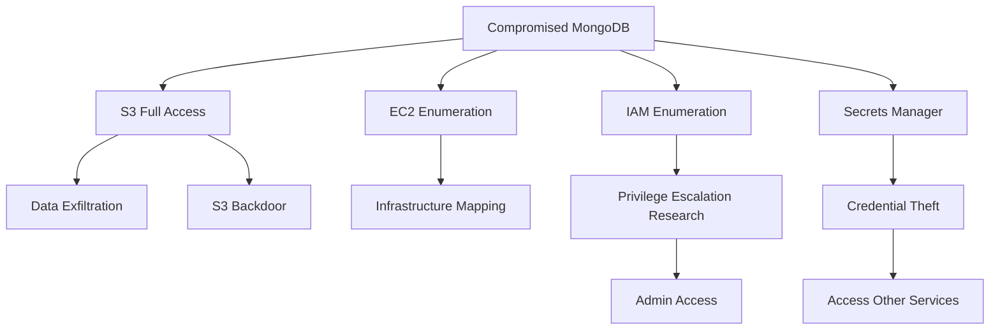

# WIZ-002: Overprivileged IAM Role

## Overview

| Attribute | Value |
|-----------|-------|
| **ID** | WIZ-002 |
| **Severity** | Critical |
| **CVSS** | 9.1 |
| **Component** | MongoDB EC2 Instance Role |
| **MITRE ATT&CK** | T1078.004 - Valid Accounts: Cloud Accounts |

## Description

The MongoDB EC2 instance has an IAM role with excessive permissions including full S3 access, EC2 enumeration, IAM enumeration, and Secrets Manager access. An attacker who compromises this instance gains significant access to the AWS account.

## Vulnerable Configuration

```hcl
# terraform/modules/mongodb-vm/iam.tf

resource "aws_iam_role_policy" "mongodb_overprivileged" {
  name = "mongodb-overprivileged-policy"
  role = aws_iam_role.mongodb.id

  policy = jsonencode({
    Version = "2012-10-17"
    Statement = [
      {
        Effect = "Allow"
        Action = [
          "s3:*"  # VULNERABLE: Full S3 access
        ]
        Resource = "*"
      },
      {
        Effect = "Allow"
        Action = [
          "ec2:Describe*"  # VULNERABLE: Full EC2 enumeration
        ]
        Resource = "*"
      },
      {
        Effect = "Allow"
        Action = [
          "iam:Get*",      # VULNERABLE: IAM enumeration
          "iam:List*"
        ]
        Resource = "*"
      },
      {
        Effect = "Allow"
        Action = [
          "secretsmanager:GetSecretValue"  # VULNERABLE: All secrets
        ]
        Resource = "*"
      }
    ]
  })
}
```

## Exploitation

### Prerequisites
- SSH access to MongoDB instance (see [WIZ-003](ssh-exposed.md))
- Or IMDS access from compromised application

### Steps

1. **Access the MongoDB instance**
   ```bash
   ssh -i keys/mongodb.pem ubuntu@<mongodb-ip>
   ```

2. **Verify instance role**
   ```bash
   aws sts get-caller-identity
   ```
   Output:
   ```json
   {
     "UserId": "AROAXXXXXXXXXXXXXXXXX:i-0abc123def456789",
     "Account": "123456789012",
     "Arn": "arn:aws:sts::123456789012:assumed-role/mongodb-role/i-0abc123def456789"
   }
   ```

3. **Enumerate S3 buckets**
   ```bash
   aws s3 ls
   ```

4. **Access any S3 bucket**
   ```bash
   aws s3 ls s3://any-bucket-in-account/
   aws s3 cp s3://any-bucket/sensitive-file.txt .
   ```

5. **Enumerate EC2 instances**
   ```bash
   aws ec2 describe-instances --query 'Reservations[*].Instances[*].[InstanceId,PrivateIpAddress,Tags[?Key==`Name`].Value]'
   ```

6. **Enumerate IAM**
   ```bash
   aws iam list-users
   aws iam list-roles
   aws iam list-attached-role-policies --role-name other-role
   ```

7. **Access secrets**
   ```bash
   aws secretsmanager list-secrets
   aws secretsmanager get-secret-value --secret-id production-database-creds
   ```

### Demo

```bash
make demo-iam
```

Output:
```
[VULNERABILITY] MongoDB has overprivileged IAM role

The MongoDB instance role has these dangerous permissions:
  - s3:* on all resources
  - ec2:Describe* on all resources
  - iam:Get*, iam:List* on all resources
  - secretsmanager:GetSecretValue on all resources

From MongoDB instance, attacker can run:
  aws s3 ls
  aws ec2 describe-instances
  aws iam list-users
  aws secretsmanager list-secrets
```

## Impact

### Access Gained
- Read/write access to ALL S3 buckets in account
- Complete visibility of EC2 infrastructure
- IAM configuration enumeration
- Access to ALL secrets in Secrets Manager

### Attack Paths



### Business Impact
- **Confidentiality**: Critical - access to all S3 data and secrets
- **Integrity**: Critical - ability to modify/delete S3 data
- **Availability**: High - potential for data destruction

## Detection

### AWS CloudTrail

Monitor for unusual API patterns from instance role:

```json
{
  "eventSource": "s3.amazonaws.com",
  "eventName": "ListBuckets",
  "userIdentity": {
    "type": "AssumedRole",
    "arn": "arn:aws:sts::123456789012:assumed-role/mongodb-role/i-xxx"
  }
}
```

### CloudWatch Alarms

```hcl
resource "aws_cloudwatch_metric_alarm" "unusual_s3_access" {
  alarm_name          = "mongodb-unusual-s3-access"
  comparison_operator = "GreaterThanThreshold"
  evaluation_periods  = 1
  metric_name         = "NumberOfObjects"
  namespace           = "AWS/S3"
  period              = 300
  statistic           = "Sum"
  threshold           = 100
  alarm_description   = "Unusual S3 access from MongoDB instance"
}
```

### IAM Access Analyzer

Will flag overly permissive policies:

```
Finding: External access to S3 via instance role
Resource: arn:aws:iam::123456789012:role/mongodb-role
Condition: Principal allows access from any EC2 instance
```

### Detection Query

```sql
-- CloudTrail Logs Insights
fields @timestamp, eventName, userIdentity.arn, sourceIPAddress
| filter userIdentity.arn like /mongodb-role/
| filter eventName not in ['GetObject', 'PutObject']  -- Expected operations
| filter eventSource in ['s3.amazonaws.com', 'iam.amazonaws.com', 'secretsmanager.amazonaws.com']
| sort @timestamp desc
| limit 100
```

## Remediation

### Least Privilege Policy

Replace with minimal required permissions:

```hcl
resource "aws_iam_role_policy" "mongodb_minimal" {
  name = "mongodb-backup-policy"
  role = aws_iam_role.mongodb.id

  policy = jsonencode({
    Version = "2012-10-17"
    Statement = [
      {
        Sid    = "BackupBucketAccess"
        Effect = "Allow"
        Action = [
          "s3:PutObject",
          "s3:GetObject",
          "s3:ListBucket"
        ]
        Resource = [
          "arn:aws:s3:::${var.backup_bucket}",
          "arn:aws:s3:::${var.backup_bucket}/backups/*"
        ]
      },
      {
        Sid    = "CloudWatchLogs"
        Effect = "Allow"
        Action = [
          "logs:CreateLogStream",
          "logs:PutLogEvents"
        ]
        Resource = "arn:aws:logs:*:*:log-group:/mongodb/*"
      }
    ]
  })
}
```

### Permission Boundaries

Add a permission boundary to prevent escalation:

```hcl
resource "aws_iam_role" "mongodb" {
  name                 = "mongodb-role"
  permissions_boundary = aws_iam_policy.boundary.arn

  assume_role_policy = jsonencode({
    Version = "2012-10-17"
    Statement = [{
      Effect    = "Allow"
      Principal = { Service = "ec2.amazonaws.com" }
      Action    = "sts:AssumeRole"
    }]
  })
}

resource "aws_iam_policy" "boundary" {
  name = "mongodb-boundary"

  policy = jsonencode({
    Version = "2012-10-17"
    Statement = [
      {
        Effect = "Allow"
        Action = [
          "s3:PutObject",
          "s3:GetObject",
          "logs:*"
        ]
        Resource = "*"
      },
      {
        Effect   = "Deny"
        Action   = ["iam:*", "organizations:*", "account:*"]
        Resource = "*"
      }
    ]
  })
}
```

### SCPs (Organization Level)

Prevent dangerous permissions account-wide:

```json
{
  "Version": "2012-10-17",
  "Statement": [
    {
      "Sid": "DenyWildcardS3",
      "Effect": "Deny",
      "Action": "s3:*",
      "Resource": "*",
      "Condition": {
        "StringNotLike": {
          "aws:PrincipalArn": [
            "arn:aws:iam::*:role/admin-*",
            "arn:aws:iam::*:role/deployment-*"
          ]
        }
      }
    }
  ]
}
```

## References

- [AWS IAM Best Practices](https://docs.aws.amazon.com/IAM/latest/UserGuide/best-practices.html)
- [Least Privilege](https://docs.aws.amazon.com/IAM/latest/UserGuide/best-practices.html#grant-least-privilege)
- [IAM Access Analyzer](https://docs.aws.amazon.com/IAM/latest/UserGuide/what-is-access-analyzer.html)
- [MITRE ATT&CK T1078.004](https://attack.mitre.org/techniques/T1078/004/)
