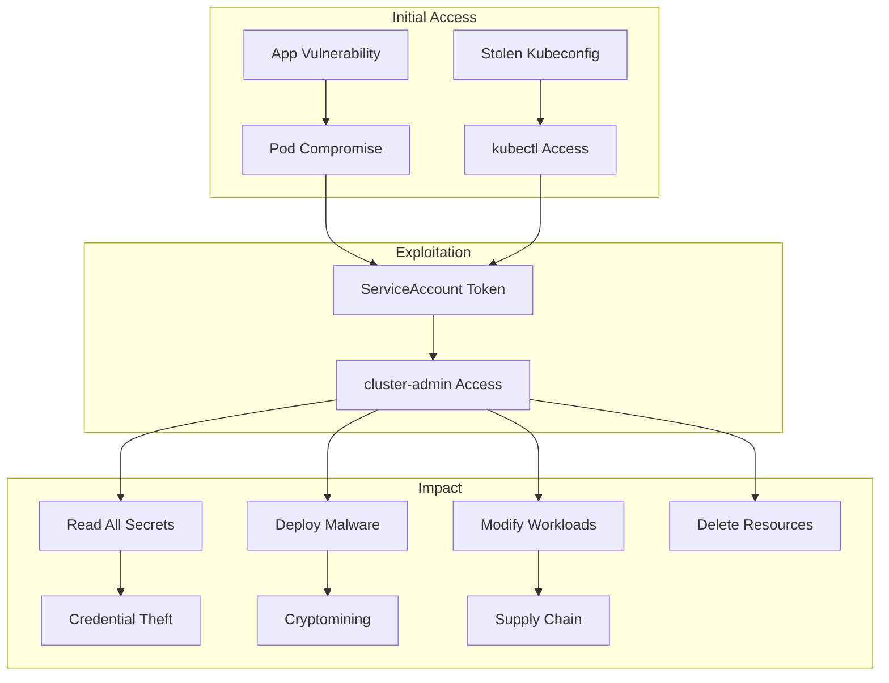

# WIZ-004: Kubernetes Cluster-Admin ServiceAccount

## Overview

| Attribute | Value |
|-----------|-------|
| **ID** | WIZ-004 |
| **Severity** | Critical |
| **CVSS** | 9.0 |
| **Component** | EKS ServiceAccount RBAC |
| **MITRE ATT&CK** | T1078.001 - Valid Accounts: Default Accounts |

## Description

The Tasky application's ServiceAccount is bound to the `cluster-admin` ClusterRole, granting it full administrative access to the entire Kubernetes cluster. Any compromise of the application pod leads to complete cluster takeover.

## Vulnerable Configuration

```yaml
# k8s/serviceaccount.yaml

apiVersion: v1
kind: ServiceAccount
metadata:
  name: tasky-sa
  namespace: tasky

---
# VULNERABLE: cluster-admin binding
apiVersion: rbac.authorization.k8s.io/v1
kind: ClusterRoleBinding
metadata:
  name: tasky-cluster-admin
subjects:
- kind: ServiceAccount
  name: tasky-sa
  namespace: tasky
roleRef:
  kind: ClusterRole
  name: cluster-admin  # FULL CLUSTER ACCESS
  apiGroup: rbac.authorization.k8s.io
```

## Exploitation

### Prerequisites
- Access to the EKS cluster (kubectl configured)
- Or: Compromise of any pod using tasky-sa

### From External Access

1. **Configure kubectl**
   ```bash
   aws eks update-kubeconfig --name wiz-exercise-eks --region us-east-1
   ```

2. **Verify ServiceAccount permissions**
   ```bash
   kubectl auth can-i --list --as=system:serviceaccount:tasky:tasky-sa
   ```
   Output:
   ```
   Resources   Non-Resource URLs   Resource Names   Verbs
   *.*         []                  []               [*]
   ```

3. **Access secrets in all namespaces**
   ```bash
   kubectl get secrets --all-namespaces
   kubectl get secret -n kube-system -o yaml
   ```

4. **Deploy malicious workload**
   ```bash
   kubectl run backdoor --image=alpine --command -- sleep infinity
   kubectl exec -it backdoor -- sh
   ```

### From Compromised Pod

If an attacker compromises the Tasky application:

```bash
# Inside the pod, ServiceAccount token is mounted at:
TOKEN=$(cat /var/run/secrets/kubernetes.io/serviceaccount/token)
CACERT=/var/run/secrets/kubernetes.io/serviceaccount/ca.crt

# Query the API server
curl -s --cacert $CACERT -H "Authorization: Bearer $TOKEN" \
  https://kubernetes.default.svc/api/v1/namespaces/kube-system/secrets
```

### Demo

```bash
make demo-k8s
```

Output:
```
[VULNERABILITY] App ServiceAccount has cluster-admin

ClusterRoleBinding:
apiVersion: rbac.authorization.k8s.io/v1
kind: ClusterRoleBinding
metadata:
  name: tasky-cluster-admin
roleRef:
  apiGroup: rbac.authorization.k8s.io
  kind: ClusterRole
  name: cluster-admin
subjects:
- kind: ServiceAccount
  name: tasky-sa
  namespace: tasky

Any pod in tasky namespace can:
  - Access secrets in ALL namespaces
  - Create/delete any resource
  - Deploy malicious workloads
```

## Impact

### Full Cluster Control
- Read all secrets across all namespaces
- Create/modify/delete any resource
- Deploy cryptocurrency miners
- Establish persistence
- Access node-level resources
- Potentially escape to underlying EC2

### Attack Paths



### Business Impact
- **Confidentiality**: Critical - all cluster secrets exposed
- **Integrity**: Critical - any resource can be modified
- **Availability**: Critical - cluster can be destroyed

## Detection

### AWS GuardDuty for EKS

Finding types:
- `PrivilegeEscalation:Kubernetes/PrivilegedContainer`
- `Persistence:Kubernetes/ContainerWithSensitiveMount`
- `Policy:Kubernetes/AdminAccessToDefaultServiceAccount`

### Kubernetes Audit Logs

```json
{
  "kind": "Event",
  "apiVersion": "audit.k8s.io/v1",
  "level": "RequestResponse",
  "user": {
    "username": "system:serviceaccount:tasky:tasky-sa"
  },
  "verb": "list",
  "objectRef": {
    "resource": "secrets",
    "namespace": "kube-system"
  }
}
```

### CloudWatch Logs Insights

```sql
fields @timestamp, user.username, verb, objectRef.resource, objectRef.namespace
| filter user.username like /tasky-sa/
| filter objectRef.namespace != 'tasky'
| sort @timestamp desc
```

### Falco Rules

```yaml
- rule: ServiceAccount Accessing Secrets Outside Namespace
  desc: Detect SA accessing secrets in other namespaces
  condition: >
    kevt and
    ka.verb in (get, list) and
    ka.target.resource = secrets and
    ka.target.namespace != ka.user.namespace
  output: >
    ServiceAccount accessing secrets outside its namespace
    (user=%ka.user.name namespace=%ka.target.namespace)
  priority: WARNING
```

## Remediation

### Minimal RBAC Configuration

Replace cluster-admin with minimal permissions:

```yaml
# Role limited to tasky namespace
apiVersion: rbac.authorization.k8s.io/v1
kind: Role
metadata:
  name: tasky-role
  namespace: tasky
rules:
# Only access specific secret
- apiGroups: [""]
  resources: ["secrets"]
  resourceNames: ["mongodb-credentials"]
  verbs: ["get"]
# Read own pods for health checks
- apiGroups: [""]
  resources: ["pods"]
  verbs: ["get", "list"]

---
# RoleBinding (not ClusterRoleBinding)
apiVersion: rbac.authorization.k8s.io/v1
kind: RoleBinding
metadata:
  name: tasky-rolebinding
  namespace: tasky
subjects:
- kind: ServiceAccount
  name: tasky-sa
  namespace: tasky
roleRef:
  kind: Role
  name: tasky-role
  apiGroup: rbac.authorization.k8s.io
```

### Disable Automount

Prevent automatic token mounting:

```yaml
apiVersion: v1
kind: ServiceAccount
metadata:
  name: tasky-sa
  namespace: tasky
automountServiceAccountToken: false  # Explicit mount if needed
```

### Pod Security Standards

Enforce restricted pod security:

```yaml
apiVersion: v1
kind: Namespace
metadata:
  name: tasky
  labels:
    pod-security.kubernetes.io/enforce: restricted
    pod-security.kubernetes.io/warn: restricted
```

### Network Policies

Restrict pod network access:

```yaml
apiVersion: networking.k8s.io/v1
kind: NetworkPolicy
metadata:
  name: tasky-network-policy
  namespace: tasky
spec:
  podSelector:
    matchLabels:
      app: tasky
  policyTypes:
  - Ingress
  - Egress
  ingress:
  - from:
    - namespaceSelector:
        matchLabels:
          name: ingress-nginx
  egress:
  - to:
    - ipBlock:
        cidr: 10.0.0.0/16  # VPC only (MongoDB)
    ports:
    - port: 27017
```

### IRSA (IAM Roles for Service Accounts)

Use IRSA instead of cluster RBAC for AWS access:

```hcl
module "irsa" {
  source = "terraform-aws-modules/iam/aws//modules/iam-role-for-service-accounts-eks"

  role_name = "tasky-irsa-role"

  oidc_providers = {
    main = {
      provider_arn = module.eks.oidc_provider_arn
      namespace_service_accounts = ["tasky:tasky-sa"]
    }
  }

  role_policy_arns = {
    policy = aws_iam_policy.tasky_minimal.arn
  }
}
```

## References

- [Kubernetes RBAC](https://kubernetes.io/docs/reference/access-authn-authz/rbac/)
- [EKS Security Best Practices](https://aws.github.io/aws-eks-best-practices/security/docs/)
- [Pod Security Standards](https://kubernetes.io/docs/concepts/security/pod-security-standards/)
- [MITRE ATT&CK T1078.001](https://attack.mitre.org/techniques/T1078/001/)
