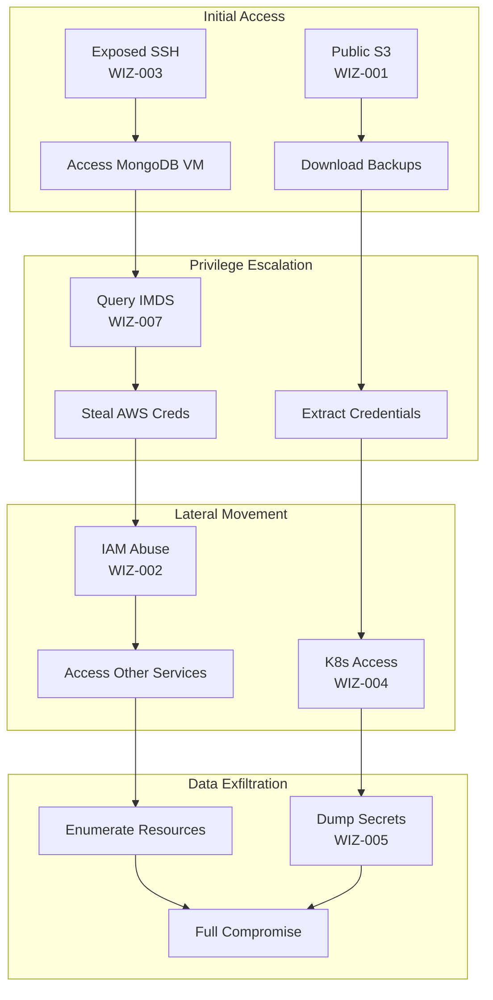
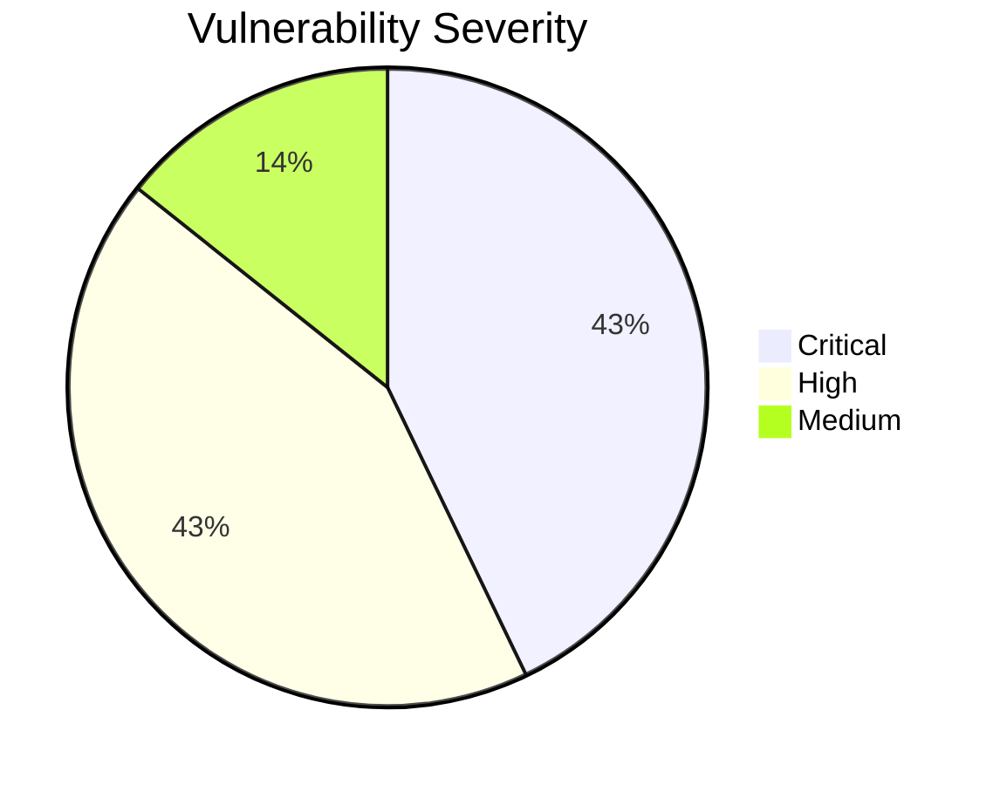

# Security Vulnerabilities Overview

This page provides a comprehensive overview of all intentional security vulnerabilities in the Wiz Technical Exercise infrastructure.

!!! danger "Educational Purpose Only"
    These vulnerabilities are **intentionally deployed** for security training. Never replicate these configurations in production environments.

## Vulnerability Matrix

| ID | Vulnerability | Severity | Component | MITRE ATT&CK |
|----|---------------|----------|-----------|--------------|
| WIZ-001 | [Public S3 Bucket](s3-public.md) | Critical | S3 | T1530 |
| WIZ-002 | [Overprivileged IAM](iam-overprivileged.md) | Critical | IAM | T1078.004 |
| WIZ-003 | [Exposed SSH](ssh-exposed.md) | High | EC2 | T1021.004 |
| WIZ-004 | [K8s Cluster-Admin](k8s-cluster-admin.md) | Critical | EKS | T1078.001 |
| WIZ-005 | [Secrets Exposure](secrets-exposure.md) | High | Kubernetes | T1552.007 |
| WIZ-006 | [Outdated MongoDB](mongodb-outdated.md) | Medium | EC2 | T1190 |
| WIZ-007 | [IMDS Exploitation](imds.md) | High | EC2 | T1552.005 |

## Attack Chain

These vulnerabilities can be chained together for a complete infrastructure compromise:

## Severity Distribution

## Quick Reference

### Critical Vulnerabilities

#### WIZ-001: Public S3 Bucket
- **Risk**: Data exfiltration without authentication
- **Demo**: `make demo-s3`
- **Detection**: GuardDuty, Security Hub

#### WIZ-002: Overprivileged IAM
- **Risk**: Full AWS account access from MongoDB VM
- **Demo**: `make demo-iam`
- **Detection**: IAM Access Analyzer

#### WIZ-004: K8s Cluster-Admin
- **Risk**: Complete Kubernetes cluster takeover
- **Demo**: `make demo-k8s`
- **Detection**: GuardDuty EKS

### High Vulnerabilities

#### WIZ-003: Exposed SSH
- **Risk**: Direct server access from internet
- **Demo**: `make demo-ssh`
- **Detection**: VPC Flow Logs, GuardDuty

#### WIZ-005: Secrets Exposure
- **Risk**: Credential theft from Kubernetes
- **Demo**: `make demo-secrets`
- **Detection**: Audit logs

#### WIZ-007: IMDS Exploitation
- **Risk**: AWS credential theft via metadata service
- **Demo**: SSH to MongoDB, run IMDS script
- **Detection**: GuardDuty

### Medium Vulnerabilities

#### WIZ-006: Outdated MongoDB
- **Risk**: Exploitation of known CVEs
- **Demo**: Check MongoDB version
- **Detection**: Inspector, Wazuh

## Detection Mapping

| Vulnerability | GuardDuty | CloudTrail | Wazuh | Security Hub |
|--------------|-----------|------------|-------|--------------|
| Public S3 | ✅ | ✅ | - | ✅ |
| Overprivileged IAM | - | ✅ | - | ✅ |
| Exposed SSH | ✅ | - | ✅ | - |
| K8s Cluster-Admin | ✅ | ✅ | - | - |
| Secrets Exposure | - | ✅ | - | - |
| Outdated MongoDB | - | - | ✅ | ✅ |
| IMDS Exploitation | ✅ | ✅ | - | - |

## Exploitation Difficulty

| Vulnerability | Skill Required | Tools Needed | Time |
|--------------|----------------|--------------|------|
| Public S3 | Beginner | AWS CLI | Minutes |
| Overprivileged IAM | Intermediate | AWS CLI | Minutes |
| Exposed SSH | Beginner | SSH client | Minutes |
| K8s Cluster-Admin | Intermediate | kubectl | Minutes |
| Secrets Exposure | Beginner | kubectl | Seconds |
| Outdated MongoDB | Advanced | Exploit code | Hours |
| IMDS Exploitation | Intermediate | curl | Minutes |

## Business Impact

| Vulnerability | Confidentiality | Integrity | Availability |
|--------------|-----------------|-----------|--------------|
| Public S3 | **Critical** | Low | Low |
| Overprivileged IAM | **Critical** | **Critical** | **Critical** |
| Exposed SSH | High | High | Medium |
| K8s Cluster-Admin | **Critical** | **Critical** | **Critical** |
| Secrets Exposure | **Critical** | Medium | Low |
| Outdated MongoDB | High | High | High |
| IMDS Exploitation | **Critical** | High | Medium |

## Remediation Summary

| Vulnerability | Fix | Effort | Priority |
|--------------|-----|--------|----------|
| Public S3 | Enable Block Public Access | Low | P0 |
| Overprivileged IAM | Apply least privilege | Medium | P0 |
| Exposed SSH | Restrict security group | Low | P0 |
| K8s Cluster-Admin | Create minimal Role/RoleBinding | Medium | P0 |
| Secrets Exposure | Use Secrets Manager + ESO | High | P1 |
| Outdated MongoDB | Upgrade to 7.x | Medium | P1 |
| IMDS Exploitation | Require IMDSv2 | Low | P1 |

## AWS Security Services

These AWS services can detect and/or prevent these vulnerabilities:

### Detection

| Service | Detects |
|---------|---------|
| GuardDuty | Unusual API activity, network threats |
| Security Hub | Misconfigurations, compliance issues |
| CloudTrail | API audit trail |
| Inspector | Software vulnerabilities |
| IAM Access Analyzer | Overprivileged resources |

### Prevention

| Service | Prevents |
|---------|----------|
| S3 Block Public Access | Public bucket access |
| SCPs | Dangerous IAM actions |
| Security Groups | Network access |
| IMDSv2 | Metadata credential theft |
| Secrets Manager | Credential exposure |

## Related Documentation

- [Attack Chain Demo](../demos/attack-chain.md)
- [Detection & Response](../demos/detection.md)
- [Security Model](../architecture/security-model.md)

## References

- [MITRE ATT&CK Cloud Matrix](https://attack.mitre.org/matrices/enterprise/cloud/)
- [AWS Security Best Practices](https://docs.aws.amazon.com/security/)
- [CIS AWS Foundations Benchmark](https://www.cisecurity.org/benchmark/amazon_web_services)
- [OWASP Cloud Security](https://owasp.org/www-project-cloud-security/)
