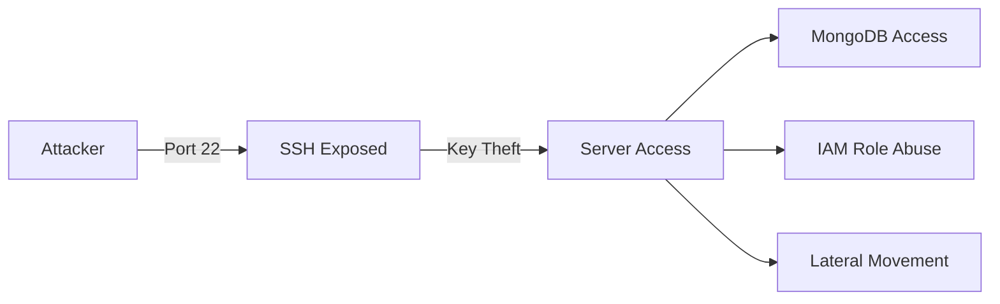
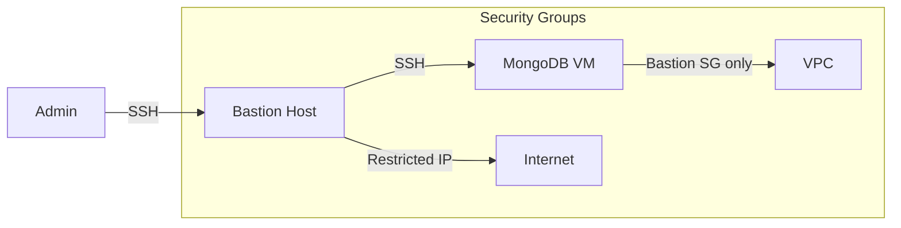

# WIZ-003: Exposed SSH

## Overview

| Attribute | Value |
|-----------|-------|
| **ID** | WIZ-003 |
| **Severity** | High |
| **CVSS** | 8.1 |
| **Component** | MongoDB EC2 Security Group |
| **MITRE ATT&CK** | T1021.004 - Remote Services: SSH |

## Description

The MongoDB EC2 instance has SSH (port 22) exposed to the entire internet (0.0.0.0/0) via its security group. While SSH is configured for public key authentication only, this exposure increases the attack surface significantly.

## Vulnerable Configuration

```hcl
# terraform/modules/mongodb-vm/security_group.tf

resource "aws_security_group" "mongodb" {
  name        = "mongodb-sg"
  description = "MongoDB security group"
  vpc_id      = var.vpc_id

  # VULNERABLE: SSH exposed to internet
  ingress {
    description = "SSH from anywhere"
    from_port   = 22
    to_port     = 22
    protocol    = "tcp"
    cidr_blocks = ["0.0.0.0/0"]  # Should be restricted!
  }

  ingress {
    description = "MongoDB from VPC"
    from_port   = 27017
    to_port     = 27017
    protocol    = "tcp"
    cidr_blocks = [var.vpc_cidr]
  }

  egress {
    from_port   = 0
    to_port     = 0
    protocol    = "-1"
    cidr_blocks = ["0.0.0.0/0"]
  }
}
```

## Exploitation

### Attack Vectors

1. **SSH Brute Force** - Automated password guessing (mitigated by key-only auth)
2. **SSH Key Theft** - If private key is compromised
3. **SSH Vulnerabilities** - Exploiting CVEs in OpenSSH
4. **Credential Stuffing** - Using leaked credentials

### Steps (with valid key)

1. **Obtain SSH key** (from SSM, leaked, or compromised developer machine)
   ```bash
   make ssh-keys
   ```

2. **Connect to instance**
   ```bash
   ssh -i keys/mongodb.pem ubuntu@<public-ip>
   ```

3. **Post-exploitation**
   ```bash
   # Access MongoDB
   mongosh -u admin -p 'password' --authenticationDatabase admin

   # Access AWS via instance role
   aws sts get-caller-identity

   # Enumerate environment
   cat /opt/redteam/env.sh
   ```

### Scanning Detection

From attacker perspective:
```bash
# Port scan
nmap -Pn -p 22 <mongodb-ip>

# Banner grab
nc -v <mongodb-ip> 22

# Check SSH version
ssh -v <mongodb-ip> 2>&1 | grep "remote software version"
```

### Demo

```bash
make demo-ssh
```

## Impact

### Direct Risks
- Server compromise if key is leaked
- Platform for lateral movement
- Access to instance role credentials
- MongoDB database access

### Indirect Risks
- Target for brute force attacks (noise, logs)
- Reconnaissance information disclosure
- Attack surface for SSH vulnerabilities

### Attack Chain



## Detection

### AWS GuardDuty

Finding types:
- `UnauthorizedAccess:EC2/SSHBruteForce`
- `Recon:EC2/PortProbeUnprotectedPort`

```json
{
  "type": "UnauthorizedAccess:EC2/SSHBruteForce",
  "severity": 2,
  "resource": {
    "resourceType": "Instance",
    "instanceDetails": {
      "instanceId": "i-0abc123def456789"
    }
  },
  "service": {
    "action": {
      "networkConnectionAction": {
        "connectionDirection": "INBOUND",
        "remotePortDetails": {
          "port": 22
        }
      }
    }
  }
}
```

### VPC Flow Logs

Monitor connections to port 22:

```sql
fields @timestamp, srcAddr, dstAddr, dstPort, action
| filter dstPort = 22
| filter action = "ACCEPT"
| stats count(*) by srcAddr
| sort count desc
| limit 20
```

### Wazuh

SSH authentication monitoring:

```xml
<rule id="5710" level="5">
  <if_sid>5700</if_sid>
  <match>^Failed</match>
  <description>SSH authentication failed.</description>
</rule>

<rule id="5712" level="10" frequency="6" timeframe="120">
  <if_matched_sid>5710</if_matched_sid>
  <description>SSH brute force attack.</description>
</rule>
```

### CloudWatch Metrics

```hcl
resource "aws_cloudwatch_metric_alarm" "ssh_connections" {
  alarm_name          = "high-ssh-connections"
  comparison_operator = "GreaterThanThreshold"
  evaluation_periods  = 2
  metric_name         = "NetworkPacketsIn"
  namespace           = "AWS/EC2"
  period              = 300
  statistic           = "Sum"
  threshold           = 10000

  dimensions = {
    InstanceId = aws_instance.mongodb.id
  }
}
```

## Remediation

### Option 1: Restrict Security Group

Limit SSH to known IPs:

```hcl
resource "aws_security_group_rule" "ssh_restricted" {
  type              = "ingress"
  from_port         = 22
  to_port           = 22
  protocol          = "tcp"
  cidr_blocks       = [
    "10.0.0.0/8",      # Internal only
    "192.168.1.0/24"   # Office IP range
  ]
  security_group_id = aws_security_group.mongodb.id
}
```

### Option 2: Use AWS Systems Manager Session Manager

Remove SSH entirely, use SSM:

```hcl
# IAM policy for SSM
resource "aws_iam_role_policy_attachment" "ssm" {
  role       = aws_iam_role.mongodb.name
  policy_arn = "arn:aws:iam::aws:policy/AmazonSSMManagedInstanceCore"
}

# Remove SSH security group rule entirely
# Access via: aws ssm start-session --target i-xxx
```

### Option 3: Bastion Host

Route SSH through a hardened bastion:



```hcl
resource "aws_security_group_rule" "ssh_from_bastion" {
  type                     = "ingress"
  from_port                = 22
  to_port                  = 22
  protocol                 = "tcp"
  source_security_group_id = aws_security_group.bastion.id
  security_group_id        = aws_security_group.mongodb.id
}
```

### Option 4: VPN/Zero Trust

Require VPN connection before SSH access:

```hcl
resource "aws_security_group_rule" "ssh_from_vpn" {
  type              = "ingress"
  from_port         = 22
  to_port           = 22
  protocol          = "tcp"
  cidr_blocks       = [aws_vpn_gateway.main.vpc_attachment[0].remote_ipv4_network_cidr]
  security_group_id = aws_security_group.mongodb.id
}
```

### SSH Hardening

Even with restricted access, harden SSH:

```bash
# /etc/ssh/sshd_config
PasswordAuthentication no
PermitRootLogin no
MaxAuthTries 3
LoginGraceTime 30
AllowUsers ubuntu
Protocol 2
ClientAliveInterval 300
ClientAliveCountMax 2
```

## References

- [AWS Security Group Best Practices](https://docs.aws.amazon.com/vpc/latest/userguide/VPC_SecurityGroups.html#SecurityGroupRules)
- [AWS Systems Manager Session Manager](https://docs.aws.amazon.com/systems-manager/latest/userguide/session-manager.html)
- [CIS Benchmark - SSH](https://www.cisecurity.org/benchmark/amazon_linux)
- [MITRE ATT&CK T1021.004](https://attack.mitre.org/techniques/T1021/004/)
