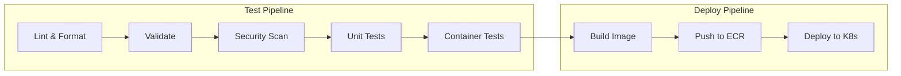

# CI/CD Integration

This document explains how automated testing integrates with the GitHub Actions CI/CD pipelines.

## Pipeline Overview



## GitHub Actions Workflows

### Test Workflow

**File:** `.github/workflows/test.yml`

Runs on every push and pull request to validate code quality.

```yaml
name: Test

on:
  push:
    branches: [main, develop]
  pull_request:
    branches: [main]

jobs:
  lint:
    runs-on: ubuntu-latest
    steps:
      - uses: actions/checkout@v4

      - name: Setup Terraform
        uses: hashicorp/setup-terraform@v3

      - name: Terraform Format Check
        run: terraform -chdir=terraform fmt -check -recursive

      - name: YAML Lint
        uses: ibiqlik/action-yamllint@v3
        with:
          file_or_dir: .github/ k8s/
          config_file: .yamllint.yml

      - name: Markdown Lint
        uses: articulate/actions-markdownlint@v1
        with:
          files: 'docs/**/*.md'

  validate:
    runs-on: ubuntu-latest
    needs: lint
    steps:
      - uses: actions/checkout@v4

      - name: Setup Terraform
        uses: hashicorp/setup-terraform@v3

      - name: Terraform Init
        run: terraform -chdir=terraform init -backend=false

      - name: Terraform Validate
        run: terraform -chdir=terraform validate

      - name: Kubernetes Validation
        run: |
          curl -sL https://github.com/yannh/kubeconform/releases/latest/download/kubeconform-linux-amd64.tar.gz | tar xz
          ./kubeconform -summary k8s/

  security:
    runs-on: ubuntu-latest
    needs: validate
    steps:
      - uses: actions/checkout@v4

      - name: tfsec
        uses: aquasecurity/tfsec-action@v1.0.0
        with:
          working_directory: terraform/
          soft_fail: true

      - name: Checkov
        uses: bridgecrewio/checkov-action@master
        with:
          directory: terraform/
          soft_fail: true
          output_format: sarif
          output_file_path: checkov-results.sarif

      - name: Upload Checkov results
        uses: github/codeql-action/upload-sarif@v2
        with:
          sarif_file: checkov-results.sarif

  unit-tests:
    runs-on: ubuntu-latest
    needs: security
    services:
      mongodb:
        image: mongo:4.4
        ports:
          - 27017:27017
    steps:
      - uses: actions/checkout@v4

      - name: Setup Go
        uses: actions/setup-go@v4
        with:
          go-version: '1.21'

      - name: Run Tests
        working-directory: app
        env:
          MONGODB_URI: mongodb://localhost:27017/test
          SECRET_KEY: test-secret-ci
        run: |
          go test -v -coverprofile=coverage.out ./...
          go tool cover -func=coverage.out

      - name: Upload Coverage
        uses: codecov/codecov-action@v3
        with:
          files: ./app/coverage.out

  container-tests:
    runs-on: ubuntu-latest
    needs: unit-tests
    steps:
      - uses: actions/checkout@v4

      - name: Build Container
        run: docker build -t tasky:test app/

      - name: Verify wizexercise.txt
        run: docker run --rm tasky:test test -f /app/wizexercise.txt

      - name: Test Health Endpoint
        run: |
          docker run -d -p 8080:8080 --name test-container tasky:test
          sleep 5
          curl -f http://localhost:8080/health
          curl -f http://localhost:8080/wizexercise
          docker stop test-container

      - name: Trivy Scan
        uses: aquasecurity/trivy-action@master
        with:
          image-ref: tasky:test
          format: 'sarif'
          output: 'trivy-results.sarif'
          severity: 'CRITICAL,HIGH'

      - name: Upload Trivy results
        uses: github/codeql-action/upload-sarif@v2
        with:
          sarif_file: trivy-results.sarif
```

### Infrastructure Deployment Workflow

**File:** `.github/workflows/deploy-infra.yml`

Deploys Terraform infrastructure with security checks.

```yaml
name: Deploy Infrastructure

on:
  workflow_dispatch:
    inputs:
      action:
        description: 'Terraform action'
        required: true
        default: 'plan'
        type: choice
        options:
          - plan
          - apply
          - destroy

env:
  TF_VAR_mongodb_admin_pass: ${{ secrets.MONGODB_ADMIN_PASS }}
  TF_VAR_mongodb_app_pass: ${{ secrets.MONGODB_APP_PASS }}
  AWS_REGION: us-east-1

jobs:
  terraform:
    runs-on: ubuntu-latest
    steps:
      - uses: actions/checkout@v4

      - name: Configure AWS Credentials
        uses: aws-actions/configure-aws-credentials@v4
        with:
          aws-access-key-id: ${{ secrets.AWS_ACCESS_KEY_ID }}
          aws-secret-access-key: ${{ secrets.AWS_SECRET_ACCESS_KEY }}
          aws-region: ${{ env.AWS_REGION }}

      - name: Setup Terraform
        uses: hashicorp/setup-terraform@v3

      - name: Terraform Init
        run: terraform -chdir=terraform init

      - name: Security Scan
        if: github.event.inputs.action != 'destroy'
        run: |
          # tfsec
          docker run --rm -v $(pwd)/terraform:/src aquasec/tfsec /src --soft-fail

          # checkov
          pip install checkov
          checkov -d terraform/ --soft-fail

      - name: Terraform Plan
        if: github.event.inputs.action == 'plan'
        run: terraform -chdir=terraform plan -var-file=environments/demo.tfvars

      - name: Terraform Apply
        if: github.event.inputs.action == 'apply'
        run: terraform -chdir=terraform apply -auto-approve -var-file=environments/demo.tfvars

      - name: Terraform Destroy
        if: github.event.inputs.action == 'destroy'
        run: terraform -chdir=terraform destroy -auto-approve -var-file=environments/demo.tfvars
```

### Application Deployment Workflow

**File:** `.github/workflows/build-deploy-app.yml`

Builds, scans, and deploys the container application.

```yaml
name: Build and Deploy App

on:
  push:
    branches: [main]
    paths:
      - 'app/**'
  workflow_dispatch:

env:
  ECR_REPOSITORY: wiz-exercise-tasky
  AWS_REGION: us-east-1

jobs:
  build-and-deploy:
    runs-on: ubuntu-latest
    steps:
      - uses: actions/checkout@v4

      - name: Configure AWS Credentials
        uses: aws-actions/configure-aws-credentials@v4
        with:
          aws-access-key-id: ${{ secrets.AWS_ACCESS_KEY_ID }}
          aws-secret-access-key: ${{ secrets.AWS_SECRET_ACCESS_KEY }}
          aws-region: ${{ env.AWS_REGION }}

      - name: Login to ECR
        id: ecr-login
        uses: aws-actions/amazon-ecr-login@v2

      - name: Build Image
        id: build
        env:
          ECR_REGISTRY: ${{ steps.ecr-login.outputs.registry }}
          IMAGE_TAG: ${{ github.sha }}
        run: |
          docker build -t $ECR_REGISTRY/$ECR_REPOSITORY:$IMAGE_TAG app/
          docker tag $ECR_REGISTRY/$ECR_REPOSITORY:$IMAGE_TAG $ECR_REGISTRY/$ECR_REPOSITORY:latest
          echo "image=$ECR_REGISTRY/$ECR_REPOSITORY:$IMAGE_TAG" >> $GITHUB_OUTPUT

      - name: Trivy Scan
        uses: aquasecurity/trivy-action@master
        with:
          image-ref: ${{ steps.build.outputs.image }}
          format: 'table'
          exit-code: '0'
          severity: 'CRITICAL,HIGH'

      - name: Grype Scan
        uses: anchore/scan-action@v3
        with:
          image: ${{ steps.build.outputs.image }}
          fail-build: false
          severity-cutoff: high

      - name: Push to ECR
        env:
          ECR_REGISTRY: ${{ steps.ecr-login.outputs.registry }}
          IMAGE_TAG: ${{ github.sha }}
        run: |
          docker push $ECR_REGISTRY/$ECR_REPOSITORY:$IMAGE_TAG
          docker push $ECR_REGISTRY/$ECR_REPOSITORY:latest

      - name: Update kubeconfig
        run: aws eks update-kubeconfig --name wiz-exercise-eks --region $AWS_REGION

      - name: Deploy to Kubernetes
        env:
          IMAGE: ${{ steps.build.outputs.image }}
        run: |
          kubectl set image deployment/tasky tasky=$IMAGE -n tasky
          kubectl rollout status deployment/tasky -n tasky --timeout=300s
```

## Test Results and Reporting

### GitHub Status Checks

Each workflow updates the commit/PR status:

| Check | Description | Required |
|-------|-------------|----------|
| lint | Code formatting and style | Yes |
| validate | Terraform and K8s validation | Yes |
| security | tfsec and Checkov scans | No (soft-fail) |
| unit-tests | Go application tests | Yes |
| container-tests | Docker build and scan | Yes |

### SARIF Reports

Security scan results are uploaded as SARIF (Static Analysis Results Interchange Format) for GitHub Security tab integration:

1. Navigate to **Security** tab in GitHub
2. Click **Code scanning alerts**
3. View findings from tfsec, Checkov, and Trivy

### Coverage Reports

Code coverage is uploaded to Codecov:

1. View badge in README
2. Detailed reports at codecov.io/gh/evanspangler/TechEx

## Running Tests Locally

Before pushing, run the full test suite locally:

```bash
# Run all tests (mirrors CI)
make test-all

# Individual test suites
make test-lint       # Linting and formatting
make test-terraform  # Terraform validation
make test-security   # Security scans
make test-k8s        # Kubernetes validation
make test-container  # Container build and scan
make test-docs       # Documentation build
```

## Debugging CI Failures

### View Workflow Logs

1. Go to **Actions** tab
2. Click failed workflow run
3. Expand failed job/step
4. View logs

### Re-run Failed Jobs

```bash
# Using GitHub CLI
gh run rerun <run-id> --failed
```

### Common Failures

| Failure | Cause | Fix |
|---------|-------|-----|
| Terraform fmt | Unformatted code | `terraform fmt -recursive` |
| Terraform validate | Syntax error | Check error message, fix HCL |
| tfsec findings | Security issues | Review finding, add suppression if intentional |
| Container build | Dockerfile error | Check build logs, test locally |
| Unit tests | Code bug | Run tests locally, debug |

## Environment Secrets

Required GitHub Secrets for CI/CD:

| Secret | Description | Used By |
|--------|-------------|---------|
| `AWS_ACCESS_KEY_ID` | AWS IAM access key | deploy-infra, build-deploy-app |
| `AWS_SECRET_ACCESS_KEY` | AWS IAM secret key | deploy-infra, build-deploy-app |
| `MONGODB_ADMIN_PASS` | MongoDB admin password | deploy-infra |
| `MONGODB_APP_PASS` | MongoDB app password | deploy-infra |
| `BACKUP_ENCRYPTION_KEY` | S3 backup encryption | deploy-infra |

## Related Documentation

- [Testing Overview](index.md)
- [Security Scanning](security-scanning.md)
- [GitHub Actions Reference](../reference/github-actions.md)
- [Makefile Reference](../reference/makefile.md)
